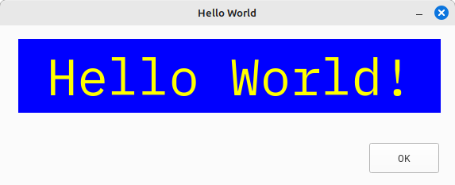

# QTPYGUI
### Author: David Worboys 
##### 2025-05-25 - Updated
##### Update
## Index
1. [Introduction](#introduction)
2. [Installation](#installation)
3. [Basic Concepts](#basic-concepts)
   - [Containers](#containers)
   - [GUI Controls](#gui-controls)
   - [Event Handling](#event-handling)
4. [Hello World Application](#building-your-first-application)
5. [Application Distribution](#distributing-your-application)
6. [Boot Camp](#boot-camp)
7. [QTPYGUI Control Reference](#qtpygui-control-api-reference) 
8. [QTPYGUI Enumerated Types/Classes](#qtpygui-enumerated-typesclass-reference)

## Introduction
QTPYGUI is a declarative user interface wrapper around Pyside6 and, as there are 
a number of GUI (Graphical User Interface) wrappers around various widget sets,
including Pyside6, the natural question is why another one? The answer lies in 
at least two parts, my dissatisfaction with how the other GUI wrappers were 
implemented/managed and because I could and there is much to be learned with 
that approach.

The next question the reader might find themselves asking is why not a web UI
based on the old favourites of HTML, CSS and Javascript, something like React 
perhaps? I am a firm believer in "horses for courses", so why bring a browser to
the desktop fight and all the resources, memory/compute, that entails when a 
well-designed widget set with better performance and memory usage is 
available. Worse, building web apps is a complicated business even with the
web UI frameworks, of course some may same the same of desktop widget sets, and 
this is where GUI wrappers like QTPYGUI come in.

In closing, it is worth noting that a major advantage in utilising a GUI wrapper,
aside from ease of programming, is that if the underlying widget set is 
deprecated, or licensing changes, then the GUI wrapper can change widget sets.
Although this would be a large task, the major benefit is that applications using 
the GUI wrapper will be minimally impacted.

### What Is A Declarative User Interface?
A declarative UI (user interface) is an application user interface coded in
the application source code using a formal specification. There is no need for
GUI designers, and the application programmer writes the UI as just another 
part of the code. This is an old idea, going back at least to the early 1980's
and applications like dBase II and Clipper but just because it is old does not 
mean it is bad or not relevant.

### Notes
1. Development of QTPYGUI started privately in 2020, moving to a public release in 2024.
   - This version is an early public release and doco and code streamlining is onging.
   
   - Although QTPYGUI is used in production applications, there are bound to be bugs, 
   certainly Dateedit and Treeview need much more work as they are infrequently 
   used.
    
   - The feature set of other GUI components needs to be widened. Missing also is
   theming and this will be required for a larger audience.

2. **HELP IS WANTED AND I WELCOME ALL CONTRIBUTIONS!**

    - Please reach out to me via Discussions (https://github.com/David-Worboys/QTPYGUI/discussions)
    if you want to help or have ideas on improvements
   
    - Bugs can be logged at https://github.com/David-Worboys/QTPYGUI/issues  

3. QTPYGUI will always remain opensource, unlike some other similar frameworks
   that used "bait and switch" tactics

4. QTPYGUI uses Python 3.13 for development and ruff (https://github.com/astral-sh/ruff)
for formatting. Type hinting is mandatory as are asserts to check all arguments to 
functions/methods

5. My time is limited (both figuratively and literally), but I will put in as 
much effort as I can to help move things along

6. I strongly suggest using Nutika (https://nuitka.net/) to distribute your 
Python desktop applications. I use this method exclusively with great success.

7. Finally, to the reader's relief, I only use Linx Mint for development and 
do not have access to a Windows installation, and therefore

   - ***HELP IS Neeeded 
   To Verify QTPYGUI's Operations Under Windows***


### Where To Find An Application That Uses QTPYGUI?
https://github.com/David-Worboys/Black-DVD-Archiver


## QTPYGUI 101
First up, QTPYGUI is pronounced "Cutey Pie GUI" which follows the "QT Groups"
own pronunciation and appeals to my, admitably lame, sense of humour.
### Prerequities
1. Python version >= 3.9, Recommended >= 3.12 
   - Nuitka now works with Python 3.13.
### Installation
1. Create your Python project folder and set up your Python project using 
the virtual environment manager of your choice

2. pip install QTPYGUI

### Boot Camp
First up, check out the examples in https://github.com/David-Worboys/QTPYGUI/tree/master/examples .
There is one example per python source file, and I will be adding more as time 
progresses.

#### Basic Concepts
1. QTPYGUI is event driven and there are no "busy" loops waiting for something
to happen

2. By default, width and height settings are in characters
   - Pixels can be used as an argument is provided to allow for this
   - This works best with monospaced fonts
   
   - The default font is "IBM Plex Mono" and the default font size is 10
     - This is included in the installation of QTPYGUI 
     - If this font is missing, then QTPYGUI will try and find a system font that 
     will work

3. The basic structure of a QTPY GUI Program is as follows:

```
import QTPYGUI.qtpygui as qtg

Class Example_App
    def __init__(self):
        """ Setup application instance variable """
        self.example_app = qtg.QtPyApp(
            display_name="Example App",
            callback=self.event_handler,
            height=100,
            width=100,
        ) 
    
    def event_handler(self, event: qtg.Action):
        """Handles  events"""
    
    def layout()-> qtg.VBoxContainer:
        """ Defines The User Interface Layout """
    
    def run(self):
        """Run Example App"""
        self.example_app.run(layout=self.layout())
        
if __name__ == "__main__":
    example_app = Example_App()
    example_app.run()            
        
```
1. This defines the structure of the application main.py file

2. https://github.com/David-Worboys/QTPYGUI/blob/master/examples/example_01.py
shows this in action.

3. The python classes that utilise a GUI are defined as below:
```
import QTPYGUI.qtpygui as qtg

Class Example_Class:
    def event_handler(self, event: qtg.Action):
        """Handles  events"""
        
    def layout()-> qtg.VBoxContainer:
        """ Defines The User Interface Layout """    

```
1. When the Example_Class is instantiated, the layout method is called to 
generate the GUI elements of the display and this is assigned to the calling 
window/GUI object

##### Containers
Containers are at the heart of the QTPYGUI system and define the layout of the 
GUI items. The following are four types of containers:

- FormContainer
  - Lays out [GUI Controls](#gui-controls-1) vertically as per the associated platform (Linux, 
  Windows, Mac) GUI specifications
- HBoxContainer
  - Lays out the [GUI Controls](#gui-controls-1) horizontally 
  
- VBoxContainer
  - Lays out the [GUI Controls](#gui-controls-1) vertically, similar to the FormContainer but does
  not adhere as tightly to the associated platform specifications
  
- GridContainer
  - Lays out the [GUI Controls](#gui-controls-1) as a grid.  This container is seldom used.

To add a GUI control to a container, the ```add_row``` method is used as below:

```
qtg.HBoxContainer(tag="button_example").add_row(
                qtg.Button(
                    tag="example_1", text="Example 1", callback=self.event_handler, width=10
                ),
                qtg.Button(
                    tag="example_2", text="Example 2", callback=self.event_handler, width=10
                ),
)                
```
- This will lay out two Buttons Horizontally. If a FormContainer or a VBoxContainer
was used, the buttons would be laid out vertically.

- **Note the use of the tag, text and callback arguments as these are fundamental
to the operation of QTPYGUI [GUI Controls](#gui-controls)**
  - If a Container has a text argument, it becomes a Group box.

##### GUI Controls
These are the GUI components that comprise the UI of an application. Declaring them
utilises a standard pattern of arguments with additional arguments for specific
[GUI Controls](#gui-controls-1).

**Note: If an argument is not supported by a GUI control, it is ignored.**

Let us consider the Button GUI control

````commandline
qtg.Button(tag="example_1", text="Example 1",label="Click Me!", callback=self.event_handler)
````
**Note: The following arguments are common to all QTPYGUI controls**

"tag" — The "tag" is the name of the control, as it is housed in a container 
then the container "tag" and the button "tag" make a unique pair.
- This makes it easier to code larger applications as each GUI element 
  does not have to have a unique name.
  
- If a "tag" is not provided, then the application generates one automatically.
  - This is fine for "Container" and "Label" objects where the programmer does 
  not intend to reference an object. 
  
"text" — The "text" is the text displayed on the control, it is optional

"label" — The "label" argument places a label to the left of the control, it is
optional

"callback" — Is the name of the method that will process the events generated
by the GUI control. By convention, I declare this as the "event_handler" method. 

- If a callback method is not provided, then the control cannot send events to it

- The "event_handler" method takes only one argument—the [Action](#action) 
instance whose properties and methods are at the heart of QTPYGUI programming 
    
    


##### Event Handling
The burning question in the reader's mind is what happens when an operation occurs
on a GUI control, say if a Button (as defined below) is clicked on:
```
qtg.Button(tag="example_2", text="Example 2", callback=self.event_handler, width=10),
```
The answer is that the ```callback``` method ```self.event_handler``` is triggered 
with a CLICKED event, and it can be processed as below:

```
    def event_handler(self, event: qtg.Action):
        """Handles  form events
        Args:
            event (qtg.Action): The triggering event
        """
        assert isinstance(self,event:qtg.Action), f"{event=}. Must be Action"

        match event.event:
            case qtg.Sys_Events.CLICKED:
                match event.tag:                    
                    case "example_2":
                        popups.PopMessage(title="Hi", message="Example 2 Was Clicked").show()
```
This results in a Pop-up window opening with a title of "Hi" displaying
"Example 2 Was Clicked" 

**Note: This is the essence of event driven programming, nothing happens until an
event is triggered, mostly by the application[GUI Controls](#gui-controls-1) - like Buttons.**

The observant reader may notice the event instance passed to the ```event handler``` 
is a class of [Action](#action) which probably should have been named 
```Event``` but for historical reasons that nomenclature is staying. 

The [Action](#action) class has a number of very useful methods and properties, and 
a programmer using QTPYGUI will become very familiar with them.

#### Building Your First Application:

As is traditional, a "hello world" program needs to be written first, so let's 
get to it!

```
import QTPYGUI.qtpygui as qtg

class Hello_World:
    def __init__(self):
        self.hello_world = qtg.QtPyApp(
            display_name="Hello World",
            callback=self.event_handler,
            height=100,
            width=100,
        )

    def event_handler(self, event: qtg.Action):
        """Handles  form events
        Args:
            event (qtg.Action): The triggering event
        """
        assert isinstance(event, qtg.Action), f"{event=}. Must be Action"

        match event.event:
            case qtg.Sys_Events.CLICKED:
                match event.tag:
                    case "ok":
                        self.hello_world.app_exit()

    def layout(self) -> qtg.VBoxContainer:
        """The layout of the window
        Returns:
            qtg.VBoxContainer: The layout
        """
        return qtg.VBoxContainer(align=qtg.Align.BOTTOMRIGHT).add_row(
            qtg.FormContainer().add_row(
                qtg.Label(
                    text="Hello World!",
                    txt_fontsize=48,
                    txt_align=qtg.Align.CENTER,
                    txt_font=qtg.Font(backcolor="blue", forecolor="yellow"),
                ),
            ),
            qtg.HBoxContainer().add_row(
                qtg.Button(
                    tag="ok",
                    text="OK",
                    callback=self.event_handler,
                    width=10,
                    tooltip="Exit Example 01",
                ),
            ),
        )

    def run(self):
        """Run example_01"""
        self.hello_world.run(layout=self.layout())

if __name__ == "__main__":
    hello_world = Hello_World()
    hello_world.run()
```

This is a slightly simplified version of example_01.

Copy the above source code into a hello_world.py file and run it like so:

```python3 -OO hello_world.py```

And the follwing screen will be displayed:
<br><br>

#### Distributing Your Application
I strongly recommend using Nuitka (https://nuitka.net/) to distribute your 
program as it can produce a single compiled file, housing all dependencies 
that can be copied to a host machine. 

Nuitka's Kay Hayen is simply the Python GOAT when it comes to this type of thing.

To compile ```hello_world.py``` the reader will need to install Nuitka

```pip install Nuitka```

and run this command:
```
python -m nuitka                                                                            \
--show-anti-bloat-changes                                                                   \
--assume-yes-for-downloads                                                                  \
--lto=yes                                                                                   \
--python-flag=-OO                                                                           \
--python-flag=no_warnings                                                                   \
--python-flag=isolated                                                                      \
--standalone                                                                                \
--onefile                                                                                   \
--prefer-source-code                                                                        \
--enable-plugin=pyside6                                                                     \
--include-qt-plugins=sensible                                                               \
--include-package-data=QTPYGUI                                                              \
hello_world.py
```
This will produce a ```hello_world.bin``` file on Linux, double-click on it and 
the ```hello_world``` application will start.

Note:
1. On occasion the ```hello_world.bin``` file will need to be made executable, and this
is done as follows:

- Right-click on the ```hello_world.bin``` file and select "Properties." This 
will open the file properties window. select  "Permissions" and tick "Allow 
executing file as program" and then "Close"

2. At the time of writing, this will produce a 58MB ```hello_world.bin``` 
executable file - This is simply how it is when distributing Python applications
 as so much is included during the build process. It is worth noting that 
PyInstaller produces even larger executables! 

## QTPYGUI Control API Reference

This section details the wide variety of GUI (Graphical User Interface) controls 
that are available to design a user interface (UI) with QTPYGUI.

Not all properties or methods will be detailed as many are inherited from their 
ancestor, the [qtpyBase_Control](#_qtpybase_control)

The properties used by almost all controls, and which should be committed to memory, are:

  - **"tag"**, the system name for the control
    - Must be specified if the control is going to be used in the code, 
    if not, it can be omitted and the system will generate
a unique tag name
  - **"callback"**, the method that will process events generated by the GUI control. 
    - Takes one argument - an [Action](#action) instance which has many useful 
    properties and methods and is critical to QTPYGUI programming. 
    - callback can be omitted for controls, like [Label](#label), where the 
    programmer has no interest in the events generated by the control
  - **"text"**, not all controls use this as they do not display text
  - **"width"**, the width of the control in characters if pixel_unit is False, Otherwise in pixels
  - **"height"**, the height of the control in characters if the pixel_unit is False, Otherwise in pixels

Only where a programmer is after a special layout or effect, will the other properties come into play
- Some controls, like the [Grid](#grid), will have special properties that need setting
  
It is suggested to set the "height" and "width" properties as the font selected might not
automatically size correctly and the defaults might not suit.
- This is particularly the case in fonts that are not monospaced.

Where the "txt_font" is set, it overrides the other text related font properties

[GUI Controls](#gui-controls-1) are housed in [Containers](#containers) and the container_tag and 
tag make a unique pair in the form layout

#### GUI Controls

| Control                         | Description                                                                                                                  |
|---------------------------------|------------------------------------------------------------------------------------------------------------------------------|
| [Button](#button)               | Creates a button, text and icon are optional                                                                                 |
| [Checkbox](#checkbox)           | Creates a check box that a user can click on or off                                                                          | 
| [ComboBox](#combobox)           | Creates a drop down selection box, icon in list is <br/>optional                                                             |
| [Dateedit](#dateedit)           | Creates a date edit control with a dropdown calendar and <br/>an erase button                                                |
| [FolderView](#folderview)       | Creates a control that displays the contents of a folder in a grid format                                                    |
| [Grid](#grid)                   | Creates a control that displays data in a table (grid) format                                                                |
| [Image](#image)                 | Creates a control that displays an image                                                                                     |
| [Label](#label)                 | Creates a text string                                                                                                        |
| [LCD](#lcd)                     | Creates a control that displays an LCD calculator display<br>Only numbers can be displayed                                   |
| [LineEdit](#lineedit)           | Creates a control that allows text to be edited and displayed<br/> in a single line                                          |
| [Menu](#menu)                   | Creates a menu just below the title bar                                                                                      |
| [PlainTextEdit](#plaintextedit) | Creates a plain text entry control that can span multiple lines                                                              |
| [ProgressBar](#progressbar)     | Creates a control that displays the progress of an operation                                                                 |
| [RadioButton](#radiobutton)     | Creates a radio button control. In a group only one can be <br/>selected at a time                                           |
| [Slider](#slider)               | Creates a slider control than can be used to set a value <br/>by dragging the handle                                         |
| [Spacer](#spacer)               | Creates a spacer control used to format layout                                                                               |
| [Spinbox](#spinbox)             | Creates a spinbox control that allows numbers to be set <br/>via clicking up and down arrows or entering the number directly |
| [Switch](#switch)               | Creates a switch control that can be used to turn on and <br/>off a feature                                                  |
| [Tab](#tab)                     | Creates a tab control that has multiple pages, each <br/>housing their own set of [GUI Controls](#gui-controls-1)            |
| [TextEdit](#textedit)           | Creates a text entry control that can span multiple lines                                                                    |
| [Timeedit](#timeedit)           | Creates a time edit control with an erase button                                                                             |
| [Treeview](#treeview)           | Creates a control that displays data as a tree view                                                                          |

### _qtpyBase_Control
 
This is the ancestor of all QTPYGUI [GUI controls](#qtpygui-control-api-reference),
and the properties here are used to set the behavior of the GUI control when instantiated.
  
**Properties** 
- Not all properties will be supported or used by descendant [GUI Controls](#gui-controls-1) and will be ignored
- Some properties will be overridden by descendant [GUI Controls](#gui-controls-1)

| **Property**      | **Type**                                       | **Description**                                                                                                                                   |
|-------------------|------------------------------------------------|---------------------------------------------------------------------------------------------------------------------------------------------------|
| align             | [Align](#align) (Align.LEFT)                   | Used to align [GUI Controls](#gui-controls-1) in containers                                                                                                          |
| allow_clear       | bool (True)                                    | True, allow [GUI Controls](#gui-controls-1) that can be cleared to be cleared, Otherwise not                                                                         |
| bold              | bool (False)                                   | True, sets [GUI Controls](#gui-controls-1) that have text bold, Otherwise not                                                                                        |
| buddy_control     | _qtpyBase_Control \| None (None)               | Set the buddy GUI control or Container                                                                                                            | 
| buddy_callback    | Callable \| None (None)                        | Sets the callback method for the buddy GUI control (Functon, Method or Lambda)                                                                    |
| callback          | Callable \| None (None)                        | Sets the callback method for the GUI control (Functon, Method or Lambda)                                                                          |
| container_tag     | str ("")                                       | Sets the container_tag for the GUI control. If "" then system generated                                                                           |
| editable          | bool (True)                                    | True, sets [GUI Controls](#gui-controls-1) that support editing into edit mode, Otherwise not                                                                        |
| enabled           | bool (True)                                    | True, enables the GUI control, Otherwise disable the GUI control                                                                                  |
| frame             | [Widget_Frame](#widget_frame) \| None (None)   | Sets the frame of a GUI control tht supports frames                                                                                               |
| icon              | None \| qtG.QIcon \| qtG.QPixmap \| str (None) | Sets the icon on a GUI control were supported. If a str then this is the filename  of the icon                                                    |
| italic            | bool (False)                                   | True, sets [GUI Controls](#gui-controls-1) that have text italic, Otherwise not                                                                                      |
| height            | int (-1)                                       | The height of the GUI control in characters if pixel_unit is False, Otherwise the height is in pixels.<br> -1 automatically calculates the height |
| label             | str ("")                                       | The label string, if not provided no label is shown                                                                                               |
| label_align       | [Align_Text](#align_text) (Align_Text.RIGHT)   | The alignment of the label text                                                                                                                   |
| label_width       | int (-1)                                       | The width of the label in  characters if pixel_unit is False, Otherwise the width is in pixels.<br> -1 automatically calculates the width         |
| label_font        | [Font](#font) \| None (None)                   | The Font of the label                                                                                                                             |
| pixel_unit        | bool (False)                                   | True, width and height settings are in pixels, Otherwise in characters                                                                            |
| size_fixed        | bool (True)                                    | True, Sets the size of the [GUI Controls](#gui-controls-1) as fixed, Otherwise not fixed. TODO: fix this setting as it has no effect                                 |
| tag               | str ("")                                       | The tag of the GUI control, system generated. If "" then system generated                                                                         |
| text              | str ("")                                       | The text displayed on the GUI control if this is supported by the GUI control                                                                     |
| tooltip           | str ("")                                       | The tooltip displayed when the mouse hovers over the GUI control                                                                                  |
| txt_align         | [Align_Text](#align_text) (Align_Text.LEFT)    | Aligns the [GUI Controls](#gui-controls-1) text, if supported.                                                                                                       |
| txt_font          | [Font](#None)\| None (None)                    | The font of the [GUI Controls](#gui-controls-1) text, if supported                                                                                                   |
| txt_fontsize      | int (DEFAULT_FONT_SIZE)                        | The fontsize in points of the GUI control text, if supported                                                                                      |
| tune_vsize        | int (0)                                        | Used to adjust the vertical size of the GUI control. In pixels                                                                                    |
| tune_hsize        | int (0)                                        | Used to adjust the horizontal size of the GUI control. In pixels                                                                                  |
| translate         | bool (True)                                    | True, translate the text on the GUI control, if supported, Otherwiise not                                                                         |
| width             | int (-1)                                       | The width of the GUI control in characters if pixel_unit is False, Otherwise the width is in pixels.<br> -1 automatically calculates the width    |
| underline         | bool (False)                                   | True, sets [GUI Controls](#gui-controls-1) that have text underline, Otherwise not                                                                                   |
| user_data         | any (None)                                     | User sepecified data attached to the GUI control                                                                                                  |
| validate_callback | Callable \| None (None)                        | A callback to validate the contents of the GUI control. Applicable only to GUI controls that allow the entry of text                              |
| visible           | bool (True)                                    | True, make the GUI control visible,Otherwise hide the GUI control                                                                                 |

**Methods** 
- Not all methods will be used by descendant [GUI Controls](#gui-controls-1)
- Some methods will be overridden

| **Method**          | **Arguments**   | **Type**                                                                                       | **Description**                                                                                                                      | **Optional** |
|---------------------|-----------------|------------------------------------------------------------------------------------------------|--------------------------------------------------------------------------------------------------------------------------------------|--------------|
| block_signals       |                 | None                                                                                           | Blocks or unblocks signals for the widget (Used rarely where signals might be generated very frequently e.g. [Slider](#slider))      |              |
|                     | block_signals   | bool (True)                                                                                    | True, stop this widget from generating signals (events), Otherwise do not stop signals (events)  being generated .           | ✓            |
| clear               |                 | None                                                                                           | Clears the contents of the GUI control, if supported                                                                                 |              | 
| buddy_text_set      |                 | None                                                                                           | Sets the text on the buddy control, where supported                                                                                  |              |
|                     | value           | str                                                                                            | The label text set to the left of the buddy widget.                                                                                  | ❌            |
| ediitable_set       |                 | None                                                                                           | Controls the edit setting of a GUI control, where supported.                                                                         |              |
|                     | editable        | bool (False)                                                                                   | True, set the GUI control editable, where supported, Otherwise not.                                                                  | ✓            |
| enable_get          |                 | bool                                                                                           | <br><b>Returns:</b><br> The enable value of the widget.<br>                                                                          |              |
| enable_set          |                 | int                                                                                            | Enables/Disables the GUI control where supported <br><b>Returns:</b><br> 1 - set ok, -1 - set failed<br>                             |              |
|                     | enable          | bool                                                                                           | True enable control, Otherwise disable the control.                                                                                  | ❌            |
| fonts_available_get |                 | tuple[str]                                                                                     | <br><b>Returns:</b><br> A tuple of font name strings.<br>                                                                            |              |
| font_set            |                 | None                                                                                           | Sets the font on the GUI control (Usually used internally as the [Font](#font) property is set when the GUI control is instantiated) |              |
|                     | app_font        | Font                                                                                           | Application font                                                                                                                     | ❌            |
|                     | widget_font     | Font                                                                                           | Control font                                                                                                                         | ❌            |
|                     | widget          | qtW.QWidget (None)                                                                             | The QT widget having the font set (defaults to current GUI control)                                                                  | ✓            |
| font_system_get     |                 | None                                                                                           | Gets the sstem font <br><b>Returns:</b><br> A QFont object.<br>                                                                      |              |
|                     | fixed           | bool (True)                                                                                    | True, return the fixed size system font, Otherwise not                                                                               |              |
| frame_style_set     |                 | None                                                                                           | Sets the frame style of the GUI control, where supported                                                                             |              |
|                     | frame           | [Widget_Frame](#widget_frame)                                                                  | Frame definition object.                                                                                                             | ✓            |
| icon_set            |                 | None                                                                                           |                                                                                                                                      |              |
|                     | icon            | None \| qtG.QIcon \| qtG.QPixmap \| str                                                        | Sets the icon on a GUI control were supported. If a str then this is the filename  of the icon                                       | ❌            |
| guiwidget_get       |                 | qtW.QWidget                                                                                    | Returns the underlying QT widget so that specialised operations can be performed<br><b>Returns:</b><br> The QT GUI widget.<br>       |              |
| guiwidget_set       |                 | None                                                                                           | Sets the GUI Control (Almost never used by QTPYGUI programmers)                                                                      |              |
|                     | widget          | qtW.QWidget \| qtG.QAction                                                                     | The widget being set                                                                                                                 | ❌            |
| pixel_str_size      |                 | [Char_Pixel_Size](#char_pixel_size)                                                            | <br><b>Returns:</b><br> The pixel size of the string in a [Char_Pixel_Size](#char_pixel_size) instance   .<br>                       |              |
|                     | text            | str                                                                                            | The text to be measured                                                                                                              | ❌            |
| pixel_char_size     |                 | [Char_Pixel_Size](#char_pixel_size)                                                            | The size of a char in pixels<br><b>Returns:</b><br> [Char_Pixel_Size](#char_pixel_size) <br>                                         |              |
|                     | char_height     | int                                                                                            | Character height in chars                                                                                                            | ❌            |
|                     | char_width      | int                                                                                            | Character width in chars                                                                                                             | ❌            |
|                     | height_fudge    | float (1.1)                                                                                    | Fudge factor multiplier to provide height adjustment                                                                                 | ✓            |
|                     | width_fudge     | float (1.1)                                                                                    | Fudge factor multiplier to provide width adjustment                                                                                  | ✓            |
| text_pixel_size     |                 | tuple[int,int]                                                                                 | Returns the height and width of a string of text in pixels <br><b>Returns:</b><br> The [height,width] of the text in pixels.<br>     |              |
|                     | text            | str                                                                                            | The text to be measured.                                                                                                             | ❌            |
| tooltip_get         |                 | str                                                                                            | <br><b>Returns:</b><br> The tooltip text.<br>                                                                                        |              |
| tooltip_set         |                 | None                                                                                           |                                                                                                                                      |              |
|                     | tooltip         | str                                                                                            | The text to display in the tooltip.                                                                                                  | ❌            |
|                     | width           | int (200) _Currently 400 for testing_                                                          | The width of the tooltip in pixels. ( Width setting is still being ignored TODO Find Fix)                                            | ✓            |
|                     | txt_color       | str                                                                                            | The color of the tooltip text. Defaults to black.                                                                                    | ✓            |
|                     | bg_color        | str                                                                                            | The background color of the tooltip. Defaults to white.                                                                              | ✓            |
|                     | border          | str                                                                                            | The border style of the tooltip. Defaults to "1px solid #000000".                                                                    | ✓            |
| tooltipsvisible_get |                 | bool                                                                                           | <br><b>Returns:</b><br> True - visible, False - not visible.<br>                                                                     |              |
| tooltipsvisible_set |                 | None                                                                                           |                                                                                                                                      |              |
|                     | visible         | bool                                                                                           | True, tooltip visible, Otherwise not.                                                                                                | ❌            |
| trans_get           |                 | bool                                                                                           | <br><b>Returns:</b><br> True - text translated, False - text not translate<br>                                                       |              |
| trans_set           |                 | None                                                                                           |                                                                                                                                      |              |
|                     | no_trans        | bool                                                                                           | True, text not translated, Otherwise text is translated                                                                              | ❌            |
| trans_str           |                 | str                                                                                            | <br><b>Returns:</b><br> The translated text.<br>                                                                                     |              |
|                     | text            | str                                                                                            | The text to be translated.                                                                                                           | ❌            |
|                     | force_translate | bool (False)                                                                                   | Translate text if True,Otherwise do not translate text. Defaults to False                                                            | ✓            |
| validate            |                 | bool                                                                                           | <br><b>Returns:</b><br> True if validation ok, otherwise False<br>                                                                   |              |
| value_get           |                 | any                                                                                            | <br><b>Returns:</b><br> The value of the widget.<br>                                                                                 |              |
| userdata_get        |                 | any                                                                                            | <br><b>Returns:</b><br> The user data stored on the widget                                                                           |              |
| userdata_set        |                 | None                                                                                           | Sets the user data on the widget.                                                                                                    |              |
|                     | user_data       | any                                                                                            | The user data can be of any type                                                                                                     | ❌            ||
| value_set           |                 | None                                                                                           | Sets the widget value                                                                                                                |              |
|                     | value           | bool \| int \| float \| [Combo_Data](#combo_data) \| str \| datetime.date \| datetime.datetime | Sets the value of the widget                                                                                                         | ❌            |
| visible_get         |                 | bool                                                                                           | <br><b>Returns:</b><br> True - widget visible, False - widget hidden.<br>                                                            |              |
| visible_set         |                 | None                                                                                           |                                                                                                                                      |              |
|                     | visible         | bool                                                                                           | True, sets widget visible, Otherwise widget hidden.                                                                                  | ❌            |

#### Button

Calling Button in a layout will generate a button control on a form. 

The "tag", "text" and "callback" arguments are generally the only arguments used. 
<br>It is suggested to set width and height as the font selected might not automatically
size correctly.  

<br>**Properties**
<br>The following properties apply when a button is instantiated with the Button 
call, as in the "fully loaded" declaration below 

<br><br>Note: A subset of [_qtpyBase_Control](#qtpygui-control-api-reference) 
properties also apply and some are used in the "fully loaded" declaration below

| **Property**         | **Description**                                                                                      | **Type**                                    | **Optional** |
|----------------------|------------------------------------------------------------------------------------------------------|---------------------------------------------|--------------|
| auto_repeat_interval | If > 0 the button keeps firing Clicked events when <br>held down (milliseconds)                      | int >= 0 (0)                                | ✓            |
| bold                 | Sets the button text bold if True otherwise not                                                      | bool (False)                                | ✓            |
| buddy_control        | Control or container with controls that sit to the right of the button                               | Container or GUI Control                    | ✓            | 
| callback             | The method called when the button is pressed                                                         | Callable (None)                             | ✓            |
| enabled              | Enables/Disables the button                                                                          | bool (True)                                 | ✓            |
| height               | The height of the button (in characters if pixel_unit is<br> False,Otherwise pixels)                 | int > 0 (10)                                | ✓            |
| icon                 | The icon image displayed on the button                                                               | str [File Name]<br/>,QIcon,QPixmap          | ✓            |
| italic               | Sets the button text italic if True otherwise not                                                    | bool (False)                                | ✓            |
| label                | Displays text to the left of the button                                                              | str ("")                                    | ✓            |
| label_align          | Alignment of the text displayed in the label                                                         | [Align_Text](#align_text) (Align_Text.LEFT) | ✓            |
| label_font           | The font definition for the label                                                                    | [Font](#font)                               | ✓            |
| label_width          | Sets the label width (in characters if pixel_unit is<br> False,Otherwise pixels)                     | int > 0 (0)                                 | ✓            |
| pixel_unit           | Use pixels for width/height, pixels if True, Otherwise characters                                    | bool (False)                                | ✓            |
| tag                  | The application name of the button                                                                   | str (System Generated)                      | ✓            |
| text                 | The text displayed on the button                                                                     | str  ("")                                   | ✓            |
| txt_align            | Alignment of the text displayed on the button                                                        | [Align_Text](#align_text) (Align_Text.LEFT) | ✓            |
| txt_font             | The font definition for the button (style will override<br> italic,size will override txt_fontsize ) | [Font](#font)                               | ✓            |
| txt_fontsize         | The point size of the text                                                                           | int (10)                                    | ✓            |
| tune_hsize           | Add or subtracts pixels units to the width. Used in aligning controls                                | int (0)                                     | ✓            |
| tune_vsize           | Add or subtracts pixels units to the height. Used in aligning controls                               | int (0)                                     | ✓            |
| tooltip              | Sets the tooltip displayed when the button is hovered over                                           | str                                         | ✓            |
| translate            | Translates text if True Otherwise does not translate                                                 | bool (True)                                 | ✓            |
| user_data            | Any data item the user wants to attach to the button                                                 | any (None )                                 | ✓            |
| underline            | Underlines the button text if True otherwise not                                                     | bool (False)                                | ✓            |
| visible              | Makes the button visible if True otherwise invisible                                                 | bool (True)                                 | ✓            |
| width                | The width of the button (in characters if pixel_unit is<br> False,Otherwise pixels)                  | int > 0 (10)                                | ✓            |

<br>A fully loaded button declaration:
<br><br>**Note: Only "tag", "text" and "callback" are usually needed**

```
Button(
        tag="button_1",
        text="Button",
        label="Button 1",
        label_align=qtg.Align_Text.CENTER,
        label_width=10,
        label_font=qtg.Font(style=qtg.Font_Style.OBLIQUE,size=14),
        callback=self.event_handler,
        width=10,
        height=1,
        txt_align=qtg.Align_Text.CENTER,
        txt_font =qtg.Font(style=qtg.Font_Style.NORMAL,size=15),
        txt_fontsize=12,
        bold=True,
        italic=True,
        underline=True,
        enabled=True,                        
        visible=True,
        tooltip="Button 1 Press Me",
        tune_hsize=15,
        tune_vsize=15,
        user_data = {"key":"value"},
        buddy_control=qtg.HBoxContainer().add_row(
            qtg.Spacer(width=1),
                    qtg.Checkbox(tag="button_check", text="Tick Me!", callback=self.event_handler, width=12)
        ),
    )
```
<br>**Methods**
<br>A subset of the [_qtpyBase_Control](#_qtpybase_control) methods apply to Button instances 

| **Method** | **Arguments** | **Type**    | **Description**                     | **Optional** |
|------------|---------------|-------------|-------------------------------------|--------------|
| text_set   |               | None        | Sets the text on the button         |              |
|            | button_text   | str         | The text to be placed on the button | ❌            |
|            | translate     | bool (True) | Translate the text                  | ✓            |

#### Checkbox

Calling Checkbox in a layout will generate a checkbox control on a form. 

The "tag", "text" and "callback" arguments are generally the only arguments used.
<br>It is suggested to set width and height as the font selected might not automatically
size correctly.

<br>**Properties**
<br>The following properties apply when a Checkbox is instantiated with the Checkbox 
call, as in the "fully loaded" declaration below

<br><br>Note: A subset of [_qtpyBase_Control](#qtpygui-control-api-reference) 
properties also apply and some are used in the "fully loaded" declaration below

| **Property**  | **Description**                                                                                        | **Type**                                    | **Optional** |
|---------------|--------------------------------------------------------------------------------------------------------|---------------------------------------------|--------------|
| bold          | Sets the checkbox text bold if True otherwise not                                                      | bool (False)                                | ✓            |
| buddy_control | Control or container with controls that sit to the right of the checkbox                               | Container or GUI Control                    | ✓            | 
| callback      | The method called when the checkbox is checked                                                         | Callable (None)                             | ✓            |
| enabled       | Enables/Disables the checkbox                                                                          | bool (True)                                 | ✓            |
| height        | The height of the checkbox (in characters if pixel_unit is False,Otherwise pixels)                     | int > 0 (10)                                | ✓            |
| italic        | Sets the checkbox text italic if True otherwise not                                                    | bool (False)                                | ✓            |
| label         | Displays text to the left of the checkbox                                                              | str ("")                                    | ✓            |
| label_align   | Alignment of the text displayed in the label                                                           | [Align_Text](#align_text) (Align_Text.LEFT) | ✓            |
| label_font    | The font definition for the label                                                                      | [Font](#font)                               | ✓            |
| label_width   | Sets the label width (in characters if pixel_unit is<br> False,Otherwise pixels)                       | int > 0 (0)                                 | ✓            |
| pixel_unit    | Use pixels for width/height, pixels if True, Otherwise characters                                      | bool (False)                                | ✓            |
| tag           | The application name of the checkbox                                                                   | str (System Generated)                      | ✓            |
| text          | The text displayed next to the checkbox                                                                | str  ("")                                   | ✓            |
| txt_align     | Alignment of the text displayed next to the checkbox                                                   | [Align_Text](#align_text) (Align_Text.LEFT) | ✓            |
| txt_font      | The font definition for the checkbox (style will override<br> italic,size will override txt_fontsize ) | [Font](#font)                               | ✓            |
| txt_fontsize  | The point size of the text                                                                             | int (10)                                    | ✓            |
| tune_hsize    | Add or subtracts pixels units to the width. Used in aligning controls                                  | int (0)                                     | ✓            |
| tune_vsize    | Add or subtracts pixels units to the height. Used in aligning controls                                 | int (0)                                     | ✓            |
| tooltip       | Sets the tooltip displayed when the checkbox is hovered over                                           | str                                         | ✓            |
| translate     | Translates text if True Otherwise does not translate                                                   | bool (True)                                 | ✓            |
| user_data     | Any data item the user wants to attach to the checkbox                                                 | any (None )                                 | ✓            |
| underline     | Underlines the checkbox text if True otherwise not                                                     | bool (False)                                | ✓            |
| visible       | Makes the checkbox visible if True otherwise invisible                                                 | bool (True)                                 | ✓            |
| width         | The width of the checkbox (in characters if pixel_unit is False,Otherwise pixels)                      | int > 0 (10)                                | ✓            |

<br>A fully loaded checkbox declaration:
<br><br>**Note: Only "tag", "text" and "callback" are usually needed**
- txt_font overrides the other text font settings

```
Checkbox(
            tag="checkbox",
            text="Tick Me!",
            label="Check Box",
            callback=self.event_handler,
            label_align=qtg.Align_Text.CENTER,
            label_width=10,
            label_font=qtg.Font(style=qtg.Font_Style.OBLIQUE, size=14),
            width=6,
            height=1,
            txt_align=qtg.Align_Text.CENTER,
            txt_font=qtg.Font(style=qtg.Font_Style.NORMAL, size=20),
            txt_fontsize=12,
            bold=True,
            italic=True,
            underline=True,
            enabled=True,
            visible=True,
            tooltip="Check Box Press Me",
            tune_hsize=15,
            tune_vsize=15,
            user_data={"key": "value"},
            buddy_control=qtg.HBoxContainer().add_row(
                qtg.Spacer(width=1),
                qtg.Button(tag="button_push", text="Push Me!", callback=self.event_handler, width=12)
            ),
    
        )
```

<br>**Methods**
<br>A subset of the [_qtpyBase_Control](#_qtpybase_control) methods apply to Checkbox instances

| **Method**     | **Arguments** | **Type** | **Description**                                                | **Optional** |
|----------------|---------------|----------|----------------------------------------------------------------|--------------|
| button_checked |               | bool     | <br><b>Returns:</b><br> The checked state of the checkbox.<br> |              |
| button_toggle  |               | None     |                                                                |              |
|                | value (True)  | bool     | True checkbox is checked, False checkbox is unchecked.         | ✓            |
| label_get      |               | str      | <br><b>Returns:</b><br> The text of the label.<br>             |              |
| value_get      |               | bool     | <br><b>Returns:</b><br> True checked, False not checked<br>    |              |
| value_set      |               | None     |                                                                |              |
|                | value         | bool     | True checkbox is checked, False checkbox is unchecked.         | ❌            |

#### ComboBox

Calling ComboBox in a layout will generate a dropdown combobox control on a form. 

The "tag" ,"text", "callback" and "items" arguments are generally the only 
arguments used. It is suggested to set width and height as the font selected 
might not automatically size correctly.

<br>**Properties**
<br>The following properties apply when a ComboBox is instantiated with the ComboBox 
call, as in the "fully loaded" declaration below

<br><br>Note: A subset of [_qtpyBase_Control](#qtpygui-control-api-reference) 
properties also apply and some are used in the "fully loaded" declaration below

| **Property**      | **Description**                                                                                                      | **Type**                                    | **Optional** |
|-------------------|----------------------------------------------------------------------------------------------------------------------|---------------------------------------------|--------------|
| bold              | Sets the combobox text bold if True otherwise not                                                                    | bool (False)                                | ✓            |
| buddy_control     | Control or container with controls that sit to the right of the combobox                                             | Container or GUI Control                    | ✓            | 
| callback          | The method called when the combobox is modified                                                                      | Callable (None)                             | ✓            |
| display_na        | Displays N/A (Not Applicable/Available) in the drop down list if True Otherwise not                                  | bool (True)                                 | ✓            |
| dropdown_width    | The width of the combobox (in characters if pixel_unit is False,Otherwise pixels)                                    | int > 0 (10)                                | ✓            |
| enabled           | Enables/Disables the combobox                                                                                        | bool (True)                                 | ✓            |
| height            | The height of the combobox (in characters if pixel_unit is False,Otherwise pixels)                                   | int > 0 (10)                                | ✓            |
| italic            | Sets the combobox text italic if True otherwise not                                                                  | bool (False)                                | ✓            |
| items             | Items to add to the ComboBox when it is instantied                                                                   | list or tuple [Combo_Item](#combo_item)     | ✓            |
| label             | Displays text to the left of the combobox                                                                            | str ("")                                    | ✓            |
| label_align       | Alignment of the text displayed in the label                                                                         | [Align_Text](#align_text) (Align_Text.LEFT) | ✓            |
| label_font        | The font definition for the label                                                                                    | [Font](#font)                               | ✓            |
| label_width       | Sets the label width (in characters if pixel_unit is<br> False,Otherwise pixels)                                     | int > 0 (0)                                 | ✓            |
| csv_file_def      | Defines the csv file that will be loaded into the ComboBox when it is instantiated                                   | [CSV_File_Def](#csv_file_def) (None)        | ✓            |
| num_visible_items | Number of items displayed in the dropdown list                                                                       | int >= 1 (15)                               | ✓            |
| pixel_unit        | Use pixels for width/height, pixels if True, Otherwise characters                                                    | bool (False)                                | ✓            |
| tag               | The application name of the combobox                                                                                 | str (System Generated)                      | ✓            |
| txt_font          | The font definition for the combobox dropdown list (style will override<br> italic,size will override txt_fontsize ) | [Font](#font)                               | ✓            |
| txt_fontsize      | The point size of the text   in the combobox dropdown list                                                           | int (10)                                    | ✓            |
| tune_hsize        | Add or subtracts pixels units to the width. Used in aligning controls                                                | int (0)                                     | ✓            |
| tune_vsize        | Add or subtracts pixels units to the height. Used in aligning controls                                               | int (0)                                     | ✓            |
| tooltip           | Sets the tooltip displayed when the combobox is hovered over                                                         | str                                         | ✓            |
| translate         | Translates dropdown text if True Otherwise does not translate                                                        | bool (True)                                 | ✓            |
| user_data         | Any data item the user wants to attach to the combobox                                                               | any (None )                                 | ✓            |
| underline         | Underlines the combobox dropdown text if True otherwise not                                                          | bool (False)                                | ✓            |
| visible           | Makes the combobox visible if True otherwise invisible                                                               | bool (True)                                 | ✓            |
| width             | The width of the combobox (in characters if pixel_unit is False,Otherwise pixels)                                    | int > 0 (10)                                | ✓            |

<br>A fully loaded combobox declaration:
<br><br>**Note: Only "tag", "text" ,"callback" and "items" are usually needed**
- txt_font overrides the other text font settings
```
ComboBox(
            tag="combo_box",
            label="Combo Box",
            display_na=True,
            dropdown_width=35,
            items=[
                qtg.Combo_Item(
                    display="Item 1",
                    data=None,
                    icon=qtg.Sys_Icon.computericon.get(),
                    user_data=None,
                ),
                qtg.Combo_Item(
                    display="Item 2", data=None, icon=None, user_data=None
                ),
                qtg.Combo_Item(
                    display="Item 3", data=None, icon=None, user_data=None
                ),
            ],
            callback=self.event_handler,
            label_align=qtg.Align_Text.CENTER,
            label_width=10,
            label_font=qtg.Font(style=qtg.Font_Style.OBLIQUE, size=14),
            width=8,
            height=1,
            txt_font=qtg.Font(style=qtg.Font_Style.ITALIC, size=12),
            txt_fontsize=12,
            bold=True,
            italic=True,
            underline=True,
            enabled=True,
            visible=True,
            tooltip="Check Box Press Me",
            tune_hsize=15,
            tune_vsize=1,
            user_data={"key": "value"},
            buddy_control=qtg.HBoxContainer().add_row(
                qtg.Spacer(width=1),
                qtg.Button(tag="button_push2", text="Push Me 2!", callback=self.event_handler, width=12)
            ),
        ),
```

<br>**Methods**
<br>A subset of the [_qtpyBase_Control](#_qtpybase_control) methods apply to ComboBox instances

| **Method**           | **Arguments**  | **Type**                             | **Description**                                                                                                                                                                                         | **Optional** |
|----------------------|----------------|--------------------------------------|---------------------------------------------------------------------------------------------------------------------------------------------------------------------------------------------------------|--------------|
| count_items          |                | int \>= 0 <= number of items in list | <br><b>Returns:</b><br> The number of items in the Combobox<br>                                                                                                                                         |              |
| display_width_set    |                | None                                 |                                                                                                                                                                                                         |              |
|                      | display_width  | int                                  | The number of characters to display in the Combobox                                                                                                                                                     | ❌            |
| get_items            |                | list [Combo_Data](#combo_data)       | <br><b>Returns:</b><br> returns the List of items in the combo box<br>                                                                                                                                  |              |
| icon_set             |                | int                                  | <br><b>Returns:</b><br> 1 if successful, -1 if not<br>                                                                                                                                                  |              |
|                      | combo_index    | int                                  | Row index in the combobox where the icon is to be placed                                                                                                                                                | ❌            |
|                      | icon           | str [File Name], QIcon,QPixmap       | A QPixmap, QIcon or the icon file name                                                                                                                                                                  | ❌            |
| is_combo_child       |                | bool                                 | <br><b>Returns:</b><br> True if the Combobox is child of another combo box. False if not.<br>                                                                                                           |              |
| load_csv_file        |                | tuple[int,str]                       | <br><b>Returns:</b><br> Length of maximum item if load OK, Otherwise -1 and error message<br>                                                                                                           |              |
|                      | csv_file_def   | [CSV_File_Def](#csv_file_def)        | The CSV file definition                                                                                                                                                                                 | ❌            |
| load_items           |                | int                                  | <br><b>Returns:</b><br> int<br>                                                                                                                                                                         |              |
|                      | auto_na        | bool (True)                          | True puts na_string (Not Available) in combobox, Otherwise not                                                                                                                                          | ✓            |
|                      | clear_items    | bool (True)                          | Clears existing items from the combobox                                                                                                                                                                 | ✓            |
|                      | na_string      | str ("N/A")                          | The "Not Available" string                                                                                                                                                                              | ✓            |
| print_all_to_console |                | None                                 | Debug method - prints items to console                                                                                                                                                                  |              |
| select_index         |                | None                                 | Scrolls to an index in the combobox and  sets the current index of the widget to the select_index argument                                                                                              |              |
|                      | select_index   | int                                  | The index of the item to select                                                                                                                                                                         | ❌            |
| select_text          |                | int                                  | Selects the text in the combobox <br><b>Returns:</b><br> The index of the selected text in the dropdown.                                                                                                |              |
|                      | select_text    | int                                  | <br><b>Returns:</b><br> The index of the selected text in the dropdown.<br>                                                                                                                             | ❌            |
|                      | case_sensitive | bool (False)                         | Whether to perform a case-sensitive match.                                                                                                                                                              | ✓            |
|                      | partial_match  | bool (False)                         | Whether to perform a partial text match.                                                                                                                                                                | ✓            |
|                      | select_text    | str                                  | The text to select.                                                                                                                                                                                     |              |
| value_get            |                | [Combo_Data](#combo_data)            | <br><b>Returns:</b><br> Current row [Combo_Data](combo_data) if index = -1, Selected row [Combo_Data](combo_data) if row > 0<br>                                                                        |              |
|                      | index          | int (-1)                             | The index of the item to get. Defaults to current row.                                                                                                                                                  | ✓            |
| value_remove         |                | None                                 | Remove an item from the combobox a the given index.                                                                                                                                                     |              |
|                      | index          | int                                  | The index of the item to remove.                                                                                                                                                                        | ❌            |
| value_set            |                | None                                 | Sets a value in the dropdown and scrolls to that value. if COMBO_DATA index is -1 then data and display. <br> Values must match for scroll to happen                                                    |              |
|                      | value          | str \| [Combo_Data](#combo_data)     | Inserts a value in the dropdown. <br>If [Combo_Data](#combo_data) index = -1 insert alphabetically when insert_alpha is True, Otherwise insert at bottom of list. if index > 1 insert at index position | ❌            |                                                                                                                                                  |
|                      | insert_alpha   | bool (True)                          | Insert alphabetically                                                                                                                                                                                   | ✓            |

#### Dateedit

Calling Dateedit in a layout will generate a Dateedit control, with an erase button
and a dropdown calendar, on a form. 

The "tag" ,"text" and "callback" arguments are generally the only arguments used. 
<br>It is suggested to set width and height as the font selected might not automatically 
size correctly.

**Constants**

| **Constant** | **Description**                                            | **Type**         |
|--------------|------------------------------------------------------------|------------------|
| MINDATE      | The minimum date supported by Dateedit (1 Jan 100 AD)      | QDate(100, 1, 1) |
| NODATE       | Used internally by Dateedit to signify a no date condition | QDate(1, 1, 1)   |

<br>**Properties**
<br>The following properties apply when a Datedit is instantiated with the 
Datedit call, as in the "fully loaded" declaration below

<br><br>Note: A subset of [_qtpyBase_Control](#qtpygui-control-api-reference) 
properties also apply and some are used in the "fully loaded" declaration below

| **Property** | **Description**                                                                                                                    | **Type** | **Optional** |
|--------------|------------------------------------------------------------------------------------------------------------------------------------|----------|--------------|
| date         | Set to the current date if not set ("")                                                                                            | str ("") | ✓            |
| format       | Date format. The `format` property is set to the current locale's date format if this is not set ("")<br>Follows QT date formating | str ("") | ✓            |
| min_date     | Set to **MINDATE** if not set ("")                                                                                                 | str ("") | ✓            |
| max_date     | Set to the to the current date if not set ("")                                                                                     | str ("") | ✓            |

<br>A fully loaded Dateedit declaration:
<br><br>**Note: Only "tag", "text" ,and "callback" are usually needed**
  - text behaves a little differently here as it serves to set the tooltip on the erase button
  - max_date, min_date and format can be used to configure the date range and 
  format of the Dateedit GUI Control if desired
  - txt_font overrides the other text font settings

```
Dateedit(
            tag="dateedit2",
            text="Tick Me!",
            date="2022-01-01",
            format="yyyy-MM-dd",
            max_date="2032-01-01",
            min_date="2000-01-01",
            label="Date edit 2",
            callback=self.event_handler,
            label_align=qtg.Align_Text.CENTER,
            label_width=10,
            label_font=qtg.Font(style=qtg.Font_Style.OBLIQUE, size=14),
            width=6,
            height=1,
            txt_align=qtg.Align_Text.CENTER,
            txt_font=qtg.Font(style=qtg.Font_Style.NORMAL, size=20),
            txt_fontsize=12,
            bold=True,
            italic=True,
            underline=True,
            enabled=True,
            visible=True,
            tooltip="Date Edit 2 ",
            tune_hsize=15,
            tune_vsize=15,
            user_data={"key": "value"},
            buddy_control=qtg.HBoxContainer().add_row(
                qtg.Spacer(width=1),
                qtg.Button(
                    tag="dateedit_button_push",
                    text="Date Edit 2 Push Me!",
                    callback=self.event_handler,
                    width=12,
                ),
        )
```

<br>**Methods**
<br>A subset of the [_qtpyBase_Control](#_qtpybase_control) methods apply to Dateedit instances

| **Method** | **Arguments**       | **Type**                          | **Description**                                                                                                  | **Optional** |
|------------|---------------------|-----------------------------------|------------------------------------------------------------------------------------------------------------------|--------------|
| clear      |                     | None                              | Clears the date displayed                                                                                        |              |
|            | default_text        | str ("-")                         | Date text to place in the edit control (must be a valid date string or - to clear the date)                      | ✓            |
| date_get   |                     | str  \| [Date_Tuple](#date_tuple) | Gets the date. If date_tuple as a [Date_Tuple](#date_tuple), Otherwise a string formatted as per date_format<br> |              |
|            | date_format ("")    | str                               | Set the date format for a string return if date_tuple is False<br>Follows QT date formating                      | ✓            |
|            | date_tuple  (False) | bool                              | True, return date format as a [Date_Tuple](#date_tuple), Otherwise a string, formated as per date_format         | ✓            |
| date_set   |                     | None                              | Sets the date in the control                                                                                     |              |
|            | date                | str ("")                          | A string representing the date to set, formatted as 'y-m-d'.                                                     | ✓            |
|            | date_format         | str ("")                          | The format of the date string, defaults to an empty string.                                                      | ✓            |
|            | default_text        | str  ("-")                        | if the date string is '-' then the date control is cleared                                                       | ✓            |
| date_valid |                     | bool                              | Checks if a date is valid<br><b>Returns:</b><br> True if date is valid, False otherwise<br>                      |              |
|            | date                | str                               | date in string format                                                                                            | ❌            |
|            | date_format         | str                               | The format of the date string.                                                                                   | ❌            |
| value_get  |                     | str \| [Date_Tuple](#date_tuple)  | Gets the date. If date_tuple as a [Date_Tuple](#date_tuple), Otherwise a string formatted as per date_format<br> |              |
|            | date_format ("")    | str                               | Set the date format for a string return if date_tuple is False<br>Follows QT date formating                      | ✓            |
|            | date_tuple  (False) | bool                              | True, return date format as a [Date_Tuple](#date_tuple), Otherwise a string, formated as per date_format         | ✓            |
| value_set  |                     | None                              | Sets the date in the control                                                                                     |              |
|            | date                | str ("")                          | A string representing the date to set, formatted as 'y-m-d'.                                                     | ✓            |
|            | date_format         | str ("")                          | The format of the date string, defaults to an empty string.                                                      | ✓            |

### FolderView

Calling FolderView in a layout will generate a FolderView control on a form.

The "tag", "text", "callback", "header_widths" and "height" arguments are generally
the only arguments used. 
<br>It is suggested to set width and height as the font 
selected might not automatically size correctly.

<br>**Properties**
<br>The following properties apply when a FolderView is instantiated with the 
FolderView call, as in the "fully loaded" declaration below

<br><br>Note: A subset of [_qtpyBase_Control](#qtpygui-control-api-reference) 
properties also apply and some are used in the "fully loaded" declaration below

| **Property**  | **Description**                                                                                                                                                                    | **Type**                                 | **Optional** |
|---------------|------------------------------------------------------------------------------------------------------------------------------------------------------------------------------------|------------------------------------------|--------------|
| width         | The width of the FolderView GUI control <br>Generally not set as header_widths determines the widths<br> Characters if [pixel_unit](#_qtpybase_control) is False, Otherwise pixels | int (40)                                 | ✓            |
| height        | The height of the FolderView GUI control<br> Characters if [pixel_unit](#_qtpybase_control) is False, Otherwise pixels                                                             | int (15)  # In  lines                    | ✓            |
| root_dir      | Sets root path of the FolderView                                                                                                                                                   | str ("\\") #Current directory            | ✓            |
| dir_only      | True, displays directories only, Otherwise display all directories and files                                                                                                       | bool (False)                             | ✓            |
| multiselect   | True, allows multiple files and/or folders to be selected, Otherwise only allow one file and/or folder to be selected at a time                                                    | bool (False)                             | ✓            |
| header_widths | Sets the header widths - maximum of 4 allowed <br> Characters if [pixel_unit](#_qtpybase_control) is False, Otherwise pixels                                                       | list [int,...] \| tuple(int,...) = (40,) | ✓            | 
| header_font   | Sets the font properties of the header row                                                                                                                                         | [Font](#font) \| None (None)             | ✓            |
| click_expand  | True, expand folders when clicked on, Otherwise only expand folders if the handle is clicked                                                                                       | bool (False)                             | ✓            |

<br>A fully loaded FolderView declaration:
<br><br>**Note: Only "tag", "text", "callback", "header_widths" and "height" are usually needed**
- txt_font overrides the other text font settings

```
FolderView(
            tag="folderview",
            label="Folder View",
            callback=self.event_handler,
            height=5,
            header_widths=[10, 10, 10, 10],
            multiselect=False,
            click_expand=False,
            label_align=qtg.Align_Text.CENTER,
            label_width=10,
            label_font=qtg.Font(style=qtg.Font_Style.OBLIQUE, size=20),
            txt_align=qtg.Align_Text.CENTER,
            txt_font=qtg.Font(style=qtg.Font_Style.NORMAL, size=14),
            header_font=qtg.Font(
                style=qtg.Font_Style.OBLIQUE,
                backcolor="cyan",
                forecolor="orange",
                size=20,
            ),
            txt_fontsize=12,
            bold=True,
            italic=True,
            underline=True,
            enabled=True,
            visible=True,
            tooltip="FolderView Press Me",
            tune_hsize=15,
            tune_vsize=15,
            user_data={"key": "value"},
            buddy_control=qtg.HBoxContainer().add_row(
                qtg.Spacer(width=1),
                qtg.Button(
                    tag="folderview_button_push",
                    text="Push Me!",
                    callback=self.event_handler,
                    width=12,
                ),
            ),
        )
```

<br>**Methods**
<br>A subset of the [_qtpyBase_Control](#_qtpybase_control) methods apply to FolderView instances

| **Method**      | **Arguments** | **Type**                | **Description**                                                                                                                                                                                                                                                         | **Optional** |
|-----------------|---------------|-------------------------|-------------------------------------------------------------------------------------------------------------------------------------------------------------------------------------------------------------------------------------------------------------------------|--------------|
| change_folder   |               | None                    | Changes the root folder for the directory view, clearing the view in the process.                                                                                                                                                                                       |              |
|                 | folder        | str                     | THe new root folder. This is not checked for validity.                                                                                                                                                                                                                  | ❌            |
| expand_on_click |               | bool                    | <br><b>Returns:</b><br> The expand on click setting. If True then the dir node expands when dir name clicked on, Otherwise not<br>                                                                                                                                      |              |
| value_get       |               | tuple[selected_node(s)] | This will return named tuple(s) of selected_nodes (selected_node, name, path, size, modified, date_modified type, isdir). <br><b>Returns:</b><br> One tuple if multiselect is False, Otherwise one or more tuples containing the file values from the selected node<br> |              |
| value_set       |               | None                    | Sets the text value of the selected node. Note: may not work in dir view only mode                                                                                                                                                                                      |              |
|                 | value         | str                     | The text to set as the current node text                                                                                                                                                                                                                                | ❌            |

### Grid

Calling Grid in a layout will generate a Grid control on a form. 

The "tag", "text", "callback", "col_def" and "height" arguments are generally 
the only arguments used. 
<br>It is suggested to set width and height as the font selected might not automatically
size correctly.

<br>**Properties**
<br>The following properties apply when a Grid is instantiated with the 
Grid call, as in the "fully loaded" declaration below

<br><br>Note: A subset of [_qtpyBase_Control](#qtpygui-control-api-reference) 
properties also apply and some are used in the "fully loaded" declaration below

| **Property** | **Description**                                                                                                                                             | **Type**                          | **Optional** |
|--------------|-------------------------------------------------------------------------------------------------------------------------------------------------------------|-----------------------------------|--------------|
| width        | The width of the Grid <br>-1 defaults to the grid column widths being used to calculate the width                                                           | int (-1)                          | ✓            |
| height       | The height of the grid                                                                                                                                      | int (BUTTON_SIZE.height)          | ✓            |
| col_def      | This is the column definitions  of the grid                                                                                                                 | list \| tuple [Col_Def](#col_del) | ❌            |
| grid_items   | If an initial grid load is required then set this to a list of [Grid_Items](#grid_item).<br> The tag field of the [Grid_Item](#grid_item) must be set to "" | list [Grid_Item](#grid_item) ([]) | ✓            |
| multiselect  | True, allow multiple selections in the grid, Otherwise do not                                                                                               | bool (False)                      | ✓            |
| noselection  | True, do not allow any selections in the grid, Otherwise allow selections                                                                                   | bool (False)                      | ✓            |
| header_sort  | True, Allow header sorting, Otherwise do not                                                                                                                | bool (True)                       | ✓            |

<br>A fully loaded Grid declaration:
<br><br>**Note: Only "tag", "text", "callback", "col_def" and "height" are usually needed**
  - Initial Grid loading is usually done by loading grid_items as below
  - txt_font overrides the other text font settings

```
Grid(
    tag="grid",
    label="Grid",
    callback=self.event_handler,
    col_def=[
        qtg.Col_Def(
            label="Col 1", checkable=True, editable=False, tag="col_1", width=10
        ),
        qtg.Col_Def(
            label="Col 2", checkable=False, editable=True, tag="col_2", width=10
        ),
    ],
    grid_items=[
                qtg.Grid_Item(row_index=0, col_index=0,current_value="value 1" , user_data=None,tag=""),
                qtg.Grid_Item(row_index=0, col_index=1,current_value="value 2" , user_data=None,tag=""),
                qtg.Grid_Item(row_index=1, col_index=0, current_value="value 3", user_data=None, tag=""),
                qtg.Grid_Item(row_index=1, col_index=1, current_value="value 4", user_data=None, tag=""),
            ],
    height=3,
    label_align=qtg.Align_Text.CENTER,
    label_width=10,
    label_font=qtg.Font(style=qtg.Font_Style.OBLIQUE,backcolor="red", size=14),
    txt_align=qtg.Align_Text.CENTER,
    txt_font=qtg.Font(style=qtg.Font_Style.NORMAL, size=15), #Does not set colours
    txt_fontsize=12,
    bold=True,
    italic=True,
    underline=True,
    enabled=True,
    visible=True,
    tooltip="Grid Me",
    tune_hsize=15,
    tune_vsize=15,
    user_data={"key": "value"},
    buddy_control=qtg.HBoxContainer().add_row(
        qtg.Spacer(width=1),
        qtg.Button(
            tag="grid_push",
            text="Grid Push Me!",
            callback=self.event_handler,
            width=12,
        ),
    )
``` 

<br>**Methods**
<br>A subset of the [_qtpyBase_Control](#_qtpybase_control) methods apply to Grid instances

| **Method**              | **Arguments** | **Type**                                                                                   | **Description**                                                                                                                                                                                                           | **Optional** |
|-------------------------|---------------|--------------------------------------------------------------------------------------------|---------------------------------------------------------------------------------------------------------------------------------------------------------------------------------------------------------------------------|--------------|
| changed                 |               | bool                                                                                       | <br><b>Returns:</b><br> True if the grid has been changed, False otherwise.<br>                                                                                                                                           |              |
| changed                 |               | None                                                                                       | Sets the changed property.                                                                                                                                                                                                |              |
|                         | value         | bool                                                                                       | Set True if the grid has been changed, False otherwise.                                                                                                                                                                   | ❌            |
| checkitemrow_get        |               | [Grid_Item](#grid_item) \| empty tuple ()                                                  | <br><b>Returns:</b><br> A Grid_Item definition containing the row_index,col_index, tag, current_value, and user_data of a item at the given row/col position.<br>                                                         |              |
|                         | col           | int                                                                                        | The index of the column to retrieve the item from.                                                                                                                                                                        | ❌            |
|                         | row           | int                                                                                        | The index of the row to retrieve the item from.                                                                                                                                                                           | ❌            |
| checkitemrow_set        |               | None                                                                                       | Sets the check state of the item at the row and column specified.                                                                                                                                                         |              |
|                         | checked       | bool                                                                                       | True, check the item, Otherwise do not                                                                                                                                                                                    | ❌            |
|                         | col           | int                                                                                        | The index of the column to set the check state for.                                                                                                                                                                       | ❌            |
|                         | row           | int                                                                                        | The index of the row to set the check state for.                                                                                                                                                                          | ❌            |
| checkitems_all          |               | None                                                                                       | Checks all items in the grid that are checkable.                                                                                                                                                                          |              |
|                         | checked       | bool (True)                                                                                | True, check an item, Otherwise uncheck.                                                                                                                                                                                   |              |
|                         | col_tag       | str  ("")                                                                                  | The column tag name. Only items in this column will be checked/unchecked. If col_tag is "" then all columns will be examined to see if they can be checked/uncheked.                                                      | ✓            |
| checkitems_get          |               | [Grid_Item](#grid_item) \| empty tuple ()                                                  | <br><b>Returns:</b><br> A tuple of all checked Grid_items in the grid or an empty tuple if no items checked<br>                                                                                                           | ✓            |
| clear                   |               | None                                                                                       | Clears the grid of all data                                                                                                                                                                                               |              |
| col_count               |               | int                                                                                        | <br><b>Returns:</b><br> The number of columns in the grid<br>                                                                                                                                                             |              |
| colindex_get            |               | int                                                                                        | <br><b>Returns:</b><br> The column index for a column tag name.<br> If the column tag is invalid an assertion error is raised                                                                                             |              |
|                         | column_tag    | str                                                                                        | The column tag name.                                                                                                                                                                                                      | ❌            |
| coltag_get              |               | str                                                                                        | <br><b>Returns:</b><br> The column tag name.<br>If the column index is invalid an assertion error is raised.<br>                                                                                                          |              |
|                         | column_index  | int                                                                                        | The column index reference.                                                                                                                                                                                               | ❌            |
| get_previous_value      |               | bool\| datetime.date \| datetime.datetime \| datetime.time \| float \| int \| str \| None  | <br><b>Returns:</b><br> The previous value stored in the column referred to by row and col<br>                                                                                                                            |              | 
|                         | col           | int (-1)                                                                                   | Col index reference. Defaults to current column                                                                                                                                                                           | ✓            |
|                         | row           | int (-1)                                                                                   | Row index reference. Defaults to current row                                                                                                                                                                              | ✓            |
| grid_item_get           |               | [Grid_Item](#grid_item) \|None                                                             | <br><b>Returns:</b><br> The Grid item referred to by row and col<br>                                                                                                                                                      |              |
|                         | col           | int (-1)                                                                                   | Column index reference. Defaults to current column                                                                                                                                                                        | ✓            |
|                         | row           | int (-1)                                                                                   | Row index reference. Defaults to current column                                                                                                                                                                           | ✓            |
| item_ids_from_row       |               | list[int]                                                                                  | <br><b>Returns:</b><br> List of  item_ids of the items found in a specified row<br>                                                                                                                                       |              |
|                         | row           | int                                                                                        | The table widget row                                                                                                                                                                                                      | ❌            |
| load_csv_file           |               | int                                                                                        | <br><b>Returns:</b><br> The length of the maximum item loaded or -1 if there is a problem with the file.<br>                                                                                                              |              |
|                         | data_index    | int (1)                                                                                    | The column index in the CSV file containing the user data to associate with the loaded data.                                                                                                                              |              |
|                         | delimiter     | str ","                                                                                    | The field separator used in the CSV file. Defaults to ",".                                                                                                                                                                |              |
|                         | file_name     | str                                                                                        | The name of the CSV file.                                                                                                                                                                                                 | ❌            |
|                         | ignore_header | bool (True)                                                                                | Set to True if the CSV file has a header row that should be ignored                                                                                                                                                       | ✓            |
|                         | line_start    | int  (1)                                                                                   | The line number in the CSV file to start loading data from                                                                                                                                                                | ✓            |
|                         | text_index    | int  (1)                                                                                   | The column index in the CSV file containing the text to display in the grid                                                                                                                                               |              |
| move_checked_block_down |               | None                                                                                       | Move the checked block down one position in the Grid                                                                                                                                                                      |              |
| move_checked_block_up   |               | None                                                                                       | Move the checked block up one position in the Grid                                                                                                                                                                        |              |
| move_row_down           |               | int                                                                                        | Move the currently selected row down one position in the Grid <br><b>Returns:</b><br> The new row or -1 if the row is at the bottom of the table<br>                                                                      |              |
|                         | move_row      | int                                                                                        | The index of the row to move                                                                                                                                                                                              | ❌            |
| move_row_up             |               | int                                                                                        | Move the currently selected row up one position in the table<br><b>Returns:</b><br> The new row or -1 if the row is at the top of the table<br>                                                                           |              |
|                         | move_row      | int                                                                                        | The index of the row to move.                                                                                                                                                                                             | ❌            |
| row_append              |               | int                                                                                        | Appends a blank row to the grid<br><b>Returns:</b><br> Row number inserted.<br>                                                                                                                                           |              |
| row_count               |               | int                                                                                        | <br><b>Returns:</b><br> Row Count (number of rows in the grid)<br>                                                                                                                                                        |              |
| row_delete              |               | None                                                                                       | Deletes a row                                                                                                                                                                                                             |              |
|                         | row           | int                                                                                        | Row index of the row in the grid that is to be deleted                                                                                                                                                                    | ❌            |
| row_from_item_id        |               | int                                                                                        | Returns the row index of the item with the specified item_id<br><b>Returns:</b><br> The row index of the item with the specified item_id. -1 if item_id not found<br>                                                     |              |
|                         | item_id       | int                                                                                        | The item_id of the item you want to find the row index for                                                                                                                                                                | ❌            |
| row_insert              |               | None                                                                                       | Inserts a row at the given row index. If row is > number of rows then a new row is inserted.                                                                                                                              |              |
|                         | row           | int                                                                                        | The row index in the grid.                                                                                                                                                                                                | ❌            |
|                         | scroll_to     | bool (True)                                                                                | True scroll to the inserted row, Otherwise not                                                                                                                                                                            | ✓            |
| row_scroll_to           |               | None                                                                                       | Scrolls to a row (Deprecated will be removed in a later release. Use select_row)                                                                                                                                          |              |
|                         | col           | int (-1)                                                                                   | -1 no column selected, Otherwise select the column indicated by col index                                                                                                                                                 | ✓            |
|                         | row           | int                                                                                        | Row to scroll to                                                                                                                                                                                                          | ❌            |
| row_widget_get          |               | [_qtpyBase_Control](#_qtpybase_control)  \| [Container](#containers)                       | <br><b>Returns:</b><br> If found, the widget or the widget container stored in the specified row and column, Otherwise None<br>                                                                                           |              |
|                         | col           | int                                                                                        | Grid column index. If -1, the current column is used, Otherwise the specified column.                                                                                                                                     | ❌            |
|                         | container_tag | str ("")                                                                                   | Container tag is needed if the desired widget is in a container                                                                                                                                                           | ✓            |
|                         | row           | int                                                                                        | Grid row index. If -1, the current row is used, Otherwise the specified row.                                                                                                                                              | ❌            |
|                         | tag           | str ("-")                                                                                  | control tag name. If "-" is supplied, the container is returned.                                                                                                                                                          |              |
| row_widget_set          |               | None                                                                                       | Sets a widget at the specified row and column                                                                                                                                                                             | ✓            |
|                         | col           | int                                                                                        | The column index of the cell to set the widget for.                                                                                                                                                                       | ❌            |
|                         | group_text    | str ("")                                                                                   | If group_text is provided the widget will be displayed in a group box with the group_text as a title                                                                                                                      | ✓            |
|                         | row           | int                                                                                        | The row index of the cell you want to set the widget for.                                                                                                                                                                 | ❌            |
|                         | widget        | [_qtpyBase_Control](#_qtpybase_control)                                                    | The widget to be inserted into the grid                                                                                                                                                                                   | ❌            |
| row_widget_tag_delete   |               | int                                                                                        | Deletes a row if the row contains a row widget with a tag that matches the row and tag passed to the method<br><b>Returns:</b><br> 1 row found and deleted, -1 no row found that matches the tag passed to the method<br> |              |
|                         | container_tag | str ("")                                                                                   | This is the container tag of the  widget (used only where the widget container tag has been set. Defaults to self.container).                                                                                             | ✓            |
|                         | tag           | str                                                                                        | The tag of the widget to be deleted.                                                                                                                                                                                      | ❌            |
|                         | widget_row    | int                                                                                        | The row housing the widget                                                                                                                                                                                                | ❌            |
| select_col              |               | None                                                                                       | Sets the current column                                                                                                                                                                                                   |              |
|                         | col           | int                                                                                        | The column index in the grid.                                                                                                                                                                                             | ❌            |
|                         | row           | int                                                                                        | The row index in the grid.                                                                                                                                                                                                | ❌            |
| select_row              |               | None                                                                                       | Scrolls to the given row                                                                                                                                                                                                  |              |
|                         | col           | int (-1)                                                                                   | The column index in the grid (defaults to -1 scroll to row only).                                                                                                                                                         | ✓            |
|                         | row           | int                                                                                        | The row index in the grid.                                                                                                                                                                                                | ❌            |
| selected_col            |               | int                                                                                        | <br><b>Returns:</b><br> The currently selected col<br>                                                                                                                                                                    |              |
| selected_row            |               | int                                                                                        | <br><b>Returns:</b><br> The currently selected row<br>                                                                                                                                                                    |              |
| userdata_get            |               | any                                                                                        | <br><b>Returns:</b><br> User data stored in column referred to by row and col<br>                                                                                                                                         |              |
|                         | col           | int (-1)                                                                                   | If -1, the current column, Otherwise column specified by column                                                                                                                                                           | ✓            |
|                         | row           | int (-1)                                                                                   | if -1, the current row, Otherwise row specified by row                                                                                                                                                                    | ✓            |
| userdata_set            |               | None                                                                                       | Sets the user data stored on the given column referred to by row and col                                                                                                                                                  |              |
|                         | col           | int (-1)                                                                                   | If -1, the current column, Otherwise column specified by column                                                                                                                                                           | ✓            |
|                         | row           | int (-1)                                                                                   | if -1, the current row, Otherwise row specified by row                                                                                                                                                                    | ✓            |
|                         | user_data     | any (None)                                                                                 | User data to be stored                                                                                                                                                                                                    |              |
| value_get               |               | bool \| datetime.date \| datetime.datetime \| datetime.time \| float \| int \| str \| None | <br><b>Returns:</b><br> The value stored in the column referenced by row and column<br>                                                                                                                                   |              |
|                         | col           | int (-1)                                                                                   | If -1, the current column, Otherwise column specified by column                                                                                                                                                           | ✓            |
|                         | row           | int (-1)                                                                                   | if -1, the current row, Otherwise row specified by row                                                                                                                                                                    | ✓            |
| value_set               |               | None                                                                                       | Sets a display value (and user data if supplied) at a given row and column                                                                                                                                                |              |
|                         | bold          | bool (False)                                                                               | If True **bolds** the display font, Otherwise not                                                                                                                                                                         | ✓            |
|                         | col           | int                                                                                        | Column index reference.                                                                                                                                                                                                   | ❌            |
|                         | italic        | bool (False)                                                                               | If True _italicises_ the display font, Otherwise not                                                                                                                                                                      | ✓            |
|                         | row           | int                                                                                        | Row index reference.                                                                                                                                                                                                      | ❌            |
|                         | tooltip       | str ("")                                                                                   | Tooltip to be displayed.                                                                                                                                                                                                  | ✓            |
|                         | underline     | bool (False)                                                                               | If True underlines the display font, Otherwise not                                                                                                                                                                        | ✓            |
|                         | user_data     | any                                                                                        | User data to be stored.                                                                                                                                                                                                   | ❌            |
|                         | value         | bool \| datetime.date \| datetime.datetime \|datetime.time \| float \| int \|str \| None   | The value to be displayed.                                                                                                                                                                                                | ❌            |
| valueorig_get           |               | bool \| datetime.date \| datetime.datetime \|datetime.time \| float \| int \|str \| None   | <br><b>Returns:</b><br> The original value stored in the column referenced to by row and col<br>                                                                                                                          |              |
|                         | col           | int (-1)                                                                                   | If -1, the current column, Otherwise column specified by column                                                                                                                                                           | ✓            |
|                         | row           | int (-1)                                                                                   | if -1, the current row, Otherwise row specified by row                                                                                                                                                                    | ✓            |

### Image

Calling Image in a layout will generate an Image control on a form. 

The "tag", "text", "callback", "height" and width arguments are generally the 
only arguments used.
<br>It is suggested to set width and height as the font selected might not automatically
size correctly.

<br>**Properties**
<br>The following properties apply when an Image is instantiated with the 
Image call, as in the "fully loaded" declaration below.
<br><br>Note: A subset of [_qtpyBase_Control](#qtpygui-control-api-reference) 
properties also apply and some are used in the "fully loaded" declaration below 

| **Property**   | **Description**                               | **Type**                                                                                                                                 | **Optional** |
|----------------|-----------------------------------------------|------------------------------------------------------------------------------------------------------------------------------------------|--------------|
| width          | The width of the image                        | int (1)                                                                                                                                  | ✓            |
| height         | The height of the Image                       | int (1)                                                                                                                                  | ✓            |
| image          | str [File name]  \| QPixmap]] \| bytes (None) | If str the image is at the file path specified, If bytes must be image file contents, Otherwise the image must be a QPixmap or None      | ✓            |                                                                     
| cached_height  | int (-1)                                      | If -1, no cached images is stored, Otherwise the cached image will be stored at the specific height<br>Aspect ratio is always maintained | ✓            |
| cached_width   | int (-1)                                      | If -1, no cached image is stored , Otherwise the cached image will be stored at the specified width<br>Aspect ratio is always maintained | ✓            |
| rotate_degrees | int (0)                                       | Rotates the image by the specified number of degrees<br>Must be int between +- 0 and 360                                                 | ✓            |

<br>A fully loaded Image declaration:
<br><br>**Note: Only "tag", "text", "callback", "height", "width" and "image" are usually needed**
  - For implementation reasons, txt_fontsize affects image size and I would 
    suggest setting to 10 or 12. 
  - txt_font overrides the other text font settings

```
qtg.Image(
            tag="image",
            label="Image",
            #width=13,
            height=10,
            callback=self.event_handler,
            image="example.jpg",
            label_align=qtg.Align_Text.CENTER,
            label_width=10,
            label_font=qtg.Font(style=qtg.Font_Style.OBLIQUE, size=14),
            txt_align=qtg.Align_Text.CENTER,
            txt_font=qtg.Font(style=qtg.Font_Style.NORMAL, size=12),
            txt_fontsize=12,
            bold=True,
            italic=True,
            underline=True,
            enabled=True,
            visible=True,
            tooltip="Image Press Me",
            tune_hsize=1,
            tune_vsize=1,
            user_data={"key": "value"},
            buddy_control=qtg.HBoxContainer().add_row(
                qtg.Spacer(width=1),
                qtg.Button(
                    tag="image_button_push",
                    text="Push Me!",
                    callback=self.event_handler,
                    width=12,
                    height=2,
                ),
            )
```

<br>**Methods**
<br>A subset of the [_qtpyBase_Control](#_qtpybase_control) methods apply to Image instances

 
| **Method**           | **Arguments**       | **Type**                                  | **Description**                                                                                                                                                                                                                                                                                                                  | **Optional** |
|----------------------|---------------------|-------------------------------------------|----------------------------------------------------------------------------------------------------------------------------------------------------------------------------------------------------------------------------------------------------------------------------------------------------------------------------------|--------------|
| clear                |                     | None                                      | Clears the visible items from the image                                                                                                                                                                                                                                                                                          |              |
| clip_get             |                     | QPixmap \| None                           | Gets a QPixmap clip of the image at the given coordinates of the given size<br><b>Returns:</b><br> A QPixmap clipped image or None if something went wrong.<br>                                                                                                                                                                  |              |
|                      | height              | int                                       | The height of the image portion to be clipped.                                                                                                                                                                                                                                                                                   | ❌            |
|                      | width               | int                                       | The width of the image portion to be clipped.                                                                                                                                                                                                                                                                                    | ❌            |
|                      | x                   | int                                       | The x coordinate of the left corner of the rectangle to be clipped.                                                                                                                                                                                                                                                              | ❌            |
|                      | y                   | int                                       | The y coordinate of top of the rectangle to be clipped.                                                                                                                                                                                                                                                                          | ❌            |
| get_height_width     |                     | tuple[int, int]                           | Gets the height and width of the image as a tuple of pixels. <br><b>Returns:</b><br> (Height,Width) in pixels<br>                                                                                                                                                                                                                |              |
| image_cache_get      |                     | QPixmap \| None                           | Returns the cached image<br><b>Returns:</b><br> The cached image if it has been set or None<br>                                                                                                                                                                                                                                  |              |
| image_cache_set      |                     | None                                      | Sets a cached image - used to speed things up if we do not want to load the image again                                                                                                                                                                                                                                          |              |
|                      | image               | QPixmap                                   | The image to be cached.                                                                                                                                                                                                                                                                                                          | ❌            |
| image_file_get       |                     | str                                       | Gets the file path of the source file<br><b>Returns:</b><br> The file path of the source file or "" if the image is not sourced from a file<br>                                                                                                                                                                                  |              |
| image_set            |                     | int                                       | Sets an image to be displayed<br><b>Returns:</b><br> 1 Ok, -1 If not                                                                                                                                                                                                                                                             |              |
|                      | cached_height       | int (-1)                                  | If -1 no cached image is stored, Otherwise create a cached image of a specific height<br>Aspect ratio always maintained                                                                                                                                                                                                          | ✓            |
|                      | cached_width        | int (-1)                                  | If -1 no cached image is stored, Otherwise create a cached image of a specific width<br>Aspect ratio always maintained                                                                                                                                                                                                           | ✓            |
|                      | height              | int (-1)                                  | Height of image, If -1 scaled to the width                                                                                                                                                                                                                                                                                       | ✓            |
|                      | high_quality        | bool (False)                              | Display image in high quality                                                                                                                                                                                                                                                                                                    | ✓            |
|                      | image               | str \| qtG.QPixmap \| bytes               | Image to be displayed                                                                                                                                                                                                                                                                                                            | ❌            |
|                      | rotate_degrees      | int (0)                                   | Rotate the image in degrees                                                                                                                                                                                                                                                                                                      | ✓            |
|                      | scaled              | bool (True)                               | Scale the image to fit height and width                                                                                                                                                                                                                                                                                          | ✓            |
|                      | width               | int  (-1)                                 | Width of image. If -1 scaled to the height                                                                                                                                                                                                                                                                                       | ✓            |
| numpy_array_get      |                     | tuple[int, int, ndarray]                  | Generates an RGB numpy array suited for dlib (and other libs the author imagines) type operations <br><b>Returns:</b><br> The tuple  (image height (pixels),image width (pixels), np.ndarray)<br>The last element is the RGB numpy array that represents the pixmap that is displayed.  Assumes only one image is displayed!<br> |              |
|                      | dlib                | bool (False)                              | If True, the array will be converted to 32bit RGB, Otherwise left as is                                                                                                                                                                                                                                                          |              |
| rectangle_coords_get |                     | [Rect_Coords](#rect_cords)                | Returns an instance of [Rect_Coords](#rect_cords)  containing the coordinates of a rectangle, given its id<br><b>Returns:</b><br> The coordinates of the rectangle.These will be set to -1 if rect_id not found<br>str<br>int<br>int<br>int<br>int<br>                                                                           |              |
|                      | rect_id             | str                                       | The ID of the rectangle.                                                                                                                                                                                                                                                                                                         | ❌            |
| rectangle_delete     |                     | bool                                      | Deletes a specific rectangle if the rect_id is provided else deletes all the rectangles in the image <br><b>Returns:</b><br> True if rectangle deleted or False if rectangle not found<br>                                                                                                                                       |              |
|                      | rect_id             | str                                       | The rect_id of the rectangle to be deleted or "" if all rectangles are to be deleted.                                                                                                                                                                                                                                            | ✓            |
| rectangle_draw       |                     | None                                      | Draws a rectangle on the currently loaded image                                                                                                                                                                                                                                                                                  |              |
|                      | colour              | str ("red")                               | Colour of rectangle line (mostly legal HTML colours)                                                                                                                                                                                                                                                                             | ✓            |
|                      | height              | int (-1)                                  | If -1, top + 50, Otherwise Height of rectangle in pixels                                                                                                                                                                                                                                                                         | ✓            |
|                      | item_id             | str                                       | Rectangle identifier. Must be a non-empty str                                                                                                                                                                                                                                                                                    | ❌            |
|                      | left                | int                                       | Left position in pixels                                                                                                                                                                                                                                                                                                          | ❌            |
|                      | top                 | int                                       | Top position in pixels                                                                                                                                                                                                                                                                                                           | ❌            |
|                      | visible             | bool (True)                               | If True, rectangle is visible, Otherwise not                                                                                                                                                                                                                                                                                     | ✓            |
|                      | width               | int (-1)                                  | If -1, left + 20 , Otherwise width of rectangle in pixels                                                                                                                                                                                                                                                                        | ✓            |
| rectangle_id_change  |                     | None                                      | Updates the rectangle id                                                                                                                                                                                                                                                                                                         |              |
|                      | new_id              | str                                       | The new rectangle_id                                                                                                                                                                                                                                                                                                             | ❌            |
|                      | old_id              | str                                       | The old rectangle_id                                                                                                                                                                                                                                                                                                             | ❌            |
| rectangle_overlaps   |                     | tuple [Overlap_Rect](#overlap_rect)       | Returns a tuple of overlapping rectangles<br><b>Returns:</b><br> A tuple containing the ids and coords of overlapping rectangles.<br>                                                                                                                                                                                            |              |
|                      | overlap_ratio       | float (0.3)                               | The ratio to determine overlapping. 0 - No overlap to 1 - Complete overlap                                                                                                                                                                                                                                                       | ✓            |
| rectangle_show       |                     | None                                      |                                                                                                                                                                                                                                                                                                                                  |              |
|                      | rect_id             | str                                       | The id of the rectangle that will be shown/hidden depending on visible                                                                                                                                                                                                                                                           | ❌            |
|                      | suppress_rect_check | bool (False)                              | Used for debugging, suppresses the assert for checking if a rect_id is in the image                                                                                                                                                                                                                                              | ✓            |
|                      | visible             | bool                                      | True shows the rectangle, False hides the rectangle                                                                                                                                                                                                                                                                              | ❌            |
| rectangles_changed   |                     | dict [str, [Rect_Changed](#rect_changed)] | Returns a dict of changed rectangles <br><b>Returns:</b><br> Dict of changed rectangles.<br>                                                                                                                                                                                                                                     |              |

### Label

Calling Label in a layout will generate a Label control on a form. 

The "tag" and "text"  are generally the only arguments used, and "tag" is only 
needed if you plan on referencing the label in your code. 
<br>It is suggested to set width and height as the font selected might not automatically
size correctly.


<br>**Properties**
<br> A Label has no special properties, but can use a subset of 
[_qtpyBase_Control](#_qtpybase_control) properties as in the "fully loaded" example below

<br>A fully loaded Label declaration:
<br><br>**Note: Only "tag", "text"are usually needed** 
   - txt_font overrides the other text font settings

```
Label(
        tag="example03",
        label="Label",
        text="Example 03",
        label_font=qtg.Font(
            font_name="Courier",
            style=qtg.Font_Style.OBLIQUE,
            size=42,
            backcolor="yellow",
            forecolor="blue",
        ),
        txt_fontsize=42,
        txt_align=qtg.Align_Text.CENTER,
        txt_font=qtg.Font(
            font_name="DejaVu Sans Mono",
            backcolor="blue",
            forecolor="yellow",
            size=50,
        ),
        width=8,
        frame=qtg.Widget_Frame(
            frame_style=qtg.Frame_Style.BOX,
            frame=qtg.Frame.RAISED,
            line_width=5,
            midline_width=2,
        ),
        height=2,
        tune_hsize=30,
        tune_vsize=15
    )
```

<br>**Methods**
<br>A subset of the [_qtpyBase_Control](#_qtpybase_control) methods apply to Label instances
| **Method** | **Arguments** | **Type** | **Description**                            | **Optional** |
|------------|---------------|----------|--------------------------------------------|--------------|
| value_get  |               | str      | <br><b>Returns:</b><br> The label text<br> |              |
| value_set  |               | None     |  Sets the label text                       |              |
|            | value         | str      | text value to set in the label             |  ❌            |

### LCD
Calling LCD in a layout will generate an LCD control, with an LCD like number 
display, on a form. This control is unusual in that it only displays a limited set 
0/O, 1, 2, 3, 4, 5/S, 6, 7, 8, 9/g, minus, decimal point, A, B, C, D, E, F, 
h, H, L, o, P, r, u, U, Y, colon, degree sign (which is specified as single 
quote in the string) and space.

Refer to the [Calculator](https://github.com/David-Worboys/QTPYGUI/blob/master/examples/example_02_calculator.py) for a simple program example

The "tag" and "text"  are generally the only arguments used, and "tag" is only 
needed if you plan on referencing the label in your code. 
<br>It is suggested to set width and height as the font selected might not automatically
size correctly.

<br>**Properties**
<br> An LCD has the following properties, but can also use a subset of 
[_qtpyBase_Control](#_qtpybase_control) properties as in the "fully loaded" example below


| **Property** | **Description**             | **Type** | **Optional** |
|--------------|-----------------------------|----------|--------------|
| digit_count  | Number of digits in display | int (8)  | ✓            |

<br>A fully loaded LCD declaration:
<br><br>**Note: Only "tag", "text"are usually needed**

   - txt_font, other than size, has little effect on the LCD control display and most text 
settings will not apply.

```
qtg.LCD(
        tag="lcd",
        label="LCD",
        callback=self.event_handler,
        label_align=qtg.Align_Text.CENTER,
        label_width=10,
        label_font=qtg.Font(style=qtg.Font_Style.OBLIQUE, backcolor="yellow", size=14),
        txt_font=qtg.Font(size=15),
        width=8,
        height=1,        
        txt_fontsize=12,
        digit_count=9,
        text="-123456.7",
        width=9,
        enabled=True,
        visible=True,
        tooltip="LCD Control",
        tune_hsize=15,
        tune_vsize=15,
        user_data={"key": "value"},
        buddy_control=qtg.HBoxContainer().add_row(
            qtg.Spacer(width=1),
            qtg.Button(
                tag="lcd_button",
                text="Press Me!",
                callback=self.event_handler,
                width=12,
            ),
        )
```
 
<br>**Methods**
<br>A subset of the [_qtpyBase_Control](#_qtpybase_control) methods apply to LCD instances

| **Method** | **Arguments** | **Type**            | **Description**                                                  | **Optional** |
|------------|---------------|---------------------|------------------------------------------------------------------|--------------|
| value_set  |               | None                | Sets the LCD number display                                      |              |
|            | value         | str \| int \| float | The value to be displayed in the LCD<br>Only numbers are allowed | ❌            |


### LineEdit
Calling LineEdit in a layout will generate a LineEdit control on a form. 

The "tag", "text" and "callback" arguments are generally the only arguments used. 
<br>It is suggested to set width and height as the font selected might not automatically
size correctly.

<br>**Properties**
<br> A LineEdit has the following properties, but can also use a subset of 
[_qtpyBase_Control](#_qtpybase_control) properties as in the "fully loaded" example below

| **Property**      | **Description**                                                      | **Type**               | **Optional** |
|-------------------|----------------------------------------------------------------------|------------------------|--------------|
| char_length       | The maximum number of characters that can be entered in the LineEdit | int (MAX_CHARS)        | ✓            |
| input_mask        | The input mask that determines what is shown in the LineEdit         | str ("")               | ✓            |
| text              | Place holder text                                                    | str ("")               | ✓            |
| validate_callback | A callback that validates the text entered                           | Callable\| None (None) | ✓            |


<br>**Input Mask**

| **Character** | **Meaning**                                                                                                           |
|---------------|-----------------------------------------------------------------------------------------------------------------------|
| A             | Character of the Letter category required, such as A-Z, a-z.                                                          |
| a             | Character of the Letter category permitted but not required.                                                          |
| N             | Character of the Letter or Number category required, such as A-Z, a-z, 0-9                                            |
| n             | Character of the Letter or Number category permitted but not required                                                 |
| X             | Any non-blank character required                                                                                      |
| x             | Any non-blank character permitted but not required                                                                    |
| 9             | Character of the Number category required, e.g 0-9                                                                    |
| 0             | Character of the Number category permitted but not required                                                           |
| D             | Character of the Number category and larger than zero required, such as 1-9                                           |
| d             | Character of the Number category and larger than zero permitted but not required, such as 1-9                         |
| #             | Character of the Number category, or plus/minus sign permitted but not required                                       |
| H             | Hexadecimal character required. A-F, a-f, 0-9                                                                         |
| h             | Hexadecimal character permitted but not required                                                                      |
| B             | Binary character required. 0-1                                                                                        |
| b             | Binary character permitted but not required                                                                           |
| >             | All following alphabetic characters are uppercased                                                                    |
| <             | All following alphabetic characters are lowercased                                                                    |
| !             | Switch off case conversion                                                                                            |
| ;c            | Terminates the input mask and sets the blank character to c.                                                          |
| [ ] { }       | Reserved                                                                                                              |
| \             | Use \ to escape the special characters listed above to use them as separators                                         |                                                                                               |
| @             | First char indicates password, following chars is the input mask. Display characters as they are entered              |
| *             | First char indicates password, following chars is the input mask. Display platform-dependent password mask characters |                                       |

<br>A fully loaded LineEdit declaration:
<br><br>**Note: Only "tag" is  usually needed and "text" if a placeholder is required**
    
  - If an input mask is provided, the placeholder text is not visible
  - A password mask would look like this: *XXXXXXXX
  - txt_font overrides the other text font settings
  - It is suggested to set "height" and width arguments as the font selected 
might not automatically size correctly.
 
```
LineEdit(
            tag="lineedit",
            label="Line Edit",
            text="Place Holder",
            callback=self.event_handler,
            input_mask="(9999) 999-9999",
            width=15,
            height=1,
            char_length=15,
            label_align=qtg.Align_Text.CENTER,
            label_width=10,
            label_font=qtg.Font(style=qtg.Font_Style.OBLIQUE, size=10),
            txt_align=qtg.Align_Text.CENTER,
            txt_font=qtg.Font(style=qtg.Font_Style.NORMAL, size=10),
            txt_fontsize=12,
            bold=True,
            italic=True,
            underline=True,
            enabled=True,
            visible=True,
            tooltip="LineEDit ",
            tune_hsize=15,
            tune_vsize=15,
            user_data={"key": "value"},
            buddy_control=qtg.HBoxContainer().add_row(
                qtg.Checkbox(
                    tag="telephone_checkbox_check",
                    text="Phone Number!",
                    callback=self.event_handler,
                    width=13,
                ),
            ),
        )
```
 
<br>**Methods**
<br>A subset of the [_qtpyBase_Control](#_qtpybase_control) methods apply to LineEdit instances

| **Method**     | **Arguments**  | **Type**     | **Description**                                                                                                                                      | **Optional** |
|----------------|----------------|--------------|------------------------------------------------------------------------------------------------------------------------------------------------------|--------------|
| input_mask_set |                | None         | Set the input mask                                                                                                                                   |              |
|                | input_mask     | str          | Input mask character string                                                                                                                          |              |
| max_chars_get  |                | int          | Returns the maximum number of characters allowed in the text field<br><b>Returns:</b><br>The max number of characters allowed in the text field.<br> |              |
| max_chars_set  |                | None         | Sets char_length and checks if is > 0 and < MAX_CHARS                                                                                                |              |
|                | max_chars      | int          | The maximum number of characters to use in the line edit control.                                                                                    |              |
| modified       |                | bool         | True, LineEdit modified, Otherwise not modified                                                                                                      |              |
| value_get      |                | str          | <br><b>Returns:</b><br> original taxt if `original_value` is `True otherwise the modified text<br>                                                   |              |
|                | original_value | bool (False) | True - Return original value, Otherwise return the current value                                                                                     |              |
| value_set      |                | None         | Set the LineEdit text to the value string                                                                                                            |              |
|                | value          | str          | The value to set.                                                                                                                                    |              |

### Menu
Calling Menu in a layout will generate a menu control on the top of the window 
that contains the application forms.

<br>**Properties**
<br> A Menu_Element has the following properties, but can also use a subset of 
[_qtpyBase_Control](#_qtpybase_control) properties.

| **Property**  | **Description**                                                                                           | **Type** | **Optional** |
|---------------|-----------------------------------------------------------------------------------------------------------|----------|--------------|
| container_tag | The system name of the menu container (required if the [Menu_Entry](#menu_entry) is accessed at run time) | str      | ✓❌           |
| tag           | The system name of the menu                                                                               | str      | ✓            |


A menu is built up of [menu elements](#menu_element) and creating a menu is straight forward:
<br>
1. Create a Menu instance
2. Add The top row menu elements with the element_add method and the parent_tag = ""
3. Add submenu elements with the parent tag pointing to the tag of the parent menu element
4. Repeat Step 3 as often as needed to make up the menu structure.
5. If a seperator is needed, set menu element text to "---" which is the constant MENU_SEPERATOR <br>
or set menu element seperator=True

The code below illustrates this process


```
menu = qtg.Menu(container_tag="main_menu",tag="top_level") # Create menu object

# Make top row menu elements - as many as needed, in this case one        
menu.element_add(
    parent_tag="",
    menu_element=qtg.Menu_Element(
        text="&Test", tag="test", callback=self.event_handler
    ),
)


# Add menu elements to the top row menu elements
menu.element_add(
    parent_tag="test",
    menu_element=qtg.Menu_Element(
        text="&Level 2 Test 1",
        tag="level2_test1",
        callback=self.event_handler,
        tooltip="Test 2",
    ),
)

# A seperator draws a line between menu elements - there are 2 ways as illustrated.
# The least preferred (using text) is commented out 
menu.element_add(
        parent_tag="test",
        menu_element=qtg.Menu_Element(                
            separator=True,
            # text= MENU_SEPERATOR                
        ),
)

menu.element_add(
    parent_tag="test",
    menu_element=qtg.Menu_Element(
        text="&Level 2 Test 2",
        tag="level2_test",
        callback=self.event_handler,
        tooltip="",
    ),
)

# Add sub-menus in this case to parent_tag="level2_test
menu.element_add(
    parent_tag="level2_test",
    menu_element=qtg.Menu_Element(
        text="&Level 3 Test",
        tag="level3_test",
        callback=self.event_handler,
        tooltip="",
    ),
)

# Add sub-menus in this case to parent_tag="level3_test 
menu.element_add(
    parent_tag="level3_test",
    menu_element=qtg.Menu_Element(
        text="&Level 4 Test",
        tag="level4_test",
        callback=self.event_handler,
        checkable=True,
        font=qtg.Font(style=qtg.Font_Style.ITALIC, forecolor="red", size=14),
        tooltip="level4_test",
        icon= qtg.Sys_Icon.filenew.get(),
    ),
)

(
    menu.element_add(
        parent_tag="level3_test", menu_element=qtg.Menu_Element(text="---")
    ),
)

menu.element_add(
    parent_tag="level3_test",
    menu_element=qtg.Menu_Element(
        text="&Level 4 Test 1",
        tag="level4_test1",
        callback=self.event_handler,
        tooltip="",
    ),
)
```
 
| **Method**  | **Arguments** | **Type**                      | **Description**                                                             | **Optional** |
|-------------|---------------|-------------------------------|-----------------------------------------------------------------------------|--------------|
| element_add |               | None                          |                                                                             |              |
|             | menu_element  | [Menu_Element](#menu_element) | Menu Element instance                                                       | ❌            |
|             | parent_tag    | str                           | Menu element tag of the parent menu element. "" is the top level parent_tag | ❌            |

#### Menu_Element
A Menu_Element is a menu control element added to the [Menu](#menu) via the 
element_add method that defines a menu item entry.

<br>**Properties**
<br> A Menu_Element has the following properties, but can also use a subset of 
[_qtpyBase_Control](#_qtpybase_control) properties.

| **Property** | **Description**                                                                                | **Type**                               | **Optional** |
|--------------|------------------------------------------------------------------------------------------------|----------------------------------------|--------------|
| callback     | The event handler method to call when the menu item is clicked on                              | Callable                               | ❌            |
| checkable    | Makes a check box in te menu item                                                              | bool (False)                           | ✓            |
| enabled      | If True enables the menu_item, Otherwise disabled the menu item                                | bool (True)                            | ✓            |
| font         | Sets the font of the menu item (colours are not currently working)                             | [Font](#font) \| Nonw (None)           | ✓            |
| icon         | Sets an icon on the menu item                                                                  | str \| qtG.QIcon \| qtG.QPixmap (None) | ✓            |
| separator    | Draws a line to separate menu items                                                            | bool (False)                           | ✓            |
| tag          | The menu items system name (required if the [Menu_Entry](#menu_entry) is accessed at run time) | str                                    | ✓❌           |
| text         | The menu item text                                                                             | str                                    | ❌            |
| tooltip      | The menu item tooltip that displays when the cursor is hovering over the menu item             | str                                    | ✓            |
| visible      | if True makes the menu item visible, otherwise the menu_item is invisible                      | bool (True)                            | ✓            |


#### Menu_Entry
A Menu_Entry instance is returned in the callback event handler method when a 
[Menu](#menu) item is selected

<br>**Properties**
<br> A Menu_Entry has the following properties, but can also use a subset of 
[_qtpyBase_Control](#_qtpybase_control) properties.

| **Property** | **Description**                                                                                                                           | **Type**                      | **Optional** |
|--------------|-------------------------------------------------------------------------------------------------------------------------------------------|-------------------------------|--------------|
| element      | The [Menu Element](#menu_element) definition that is contained in this Menu Entry                                                         | [Menu_Element](#menu_element) | ❌            |
| parent_tag   | The tag name of the [Menu Element](#menu_element) that is the parent of this Menu_Entry<br> Top level menu items do not have a parent_tag | str ("")                      | ✓            |
| tag          | The tag name of the [Menu Element](#menu_element) that is contained in this Menu Entry                                                    | str                           | ❌            |

<br>**Methods**
<br>A subset of the [_qtpyBase_Control](#_qtpybase_control) methods apply to Menu_Entry instances
<br><br>**Note: A menu item cannot have a checked box and an icon simultaneously. If an icon is set then a checkbox is not displayed**

| **Method**  | **Arguments** | **Type**                                | **Description**                                                                       | **Optional** |
|-------------|---------------|-----------------------------------------|---------------------------------------------------------------------------------------|--------------|
| checked_get |               | bool                                    | <br><b>Returns:</b><br> True - Menu Item Checked, Otherwise Menu Item Not Checked<br> |              |
| checked_set |               | None                                    | Sets a menu item to be checked or not checked                                         |              |
|             | checked       | bool                                    | True - Check menu item, False - Uncheck Menu Item                                     | ❌            |
| enabled_get |               | bool                                    | br><b>Returns:</b><br> True - Menu Item Enabled, False - Menu Item Disabled<br>       |              |
| enabled_set |               | None                                    | Sets a menu item to be enabled or not enabled                                         |              |
|             | enabled       | bool                                    | True - Enable menu item, Otherwise disable Menu Item                                  | ❌            |
| font_get    |               | QFont                                   | <br><b>Returns:</b><br> The font of the menu item<br>                                 |              |
| font_set    |               | None                                    | Sets the font of the menu item                                                        |              |
|             | font          | [Font](#font)                           |                                                                                       | ❌            |
| icon_get    |               | None                                    | <br><b>Returns:</b><br> The icon of the menu item<br>                                 |              |
| icon_set    |               | str \| qtG.QPixmap \| qtG.QIcon \| None | Sets the icon of the menu item                                                        |              |
| text_get    |               | str                                     | <br><b>Returns:</b><br> The text of the menu item<br>                                 | ❌            |
| text_set    |               | None                                    | Sets the text of the menu item                                                        |              |
|             | text          | str                                     | The text to set                                                                       | ❌            |
| tooltip_get |               | str                                     | <br><b>Returns:</b><br> The tooltip of the menu item<br>                              |              |
| tooltip_set |               | None                                    | Sets the tooltip of the menu item                                                     |              |
|             | tooltip       | str                                     | The tooltip to set                                                                    | ❌            |
| visible_get |               | bool                                    | <br><b>Returns:</b><br> True - Menu Item Visible, False - Menu Item Not Visible<br>   |              |
| visible_set |               | None                                    | Sets a menu item to visible or not visible                                            |              |
|             | visible       | bool                                    | True - Menu item visible, Otherwise Menu item not visible                             | ❌            |

### PlainTextEdit

Calling PlainTextEdit in a layout will generate a PlainTextEdit control on a form. 
A PlainTextEdit control is used to enter or display a large amount of plain text. The standard use case is for logs.
 

<br>**Properties**
<br> A PlainTextEdit control has the following properties, but can also use a subset of 
[_qtpyBase_Control](#_qtpybase_control) properties, which are not shown in the "fully loaded" example below

| **Property** | **Description**                                                                                   | **Type**      | **Optional** |
|--------------|---------------------------------------------------------------------------------------------------|---------------|--------------|
| height       | Characters if [pixel_unit](#_qtpybase_control) is False, Otherwise pixels. This will need setting | int (1)       | ✓            | |
| max_chars    | The maximum number of characters that can be entered into the PlainTextEdit control               | int (-1)      | ✓            |
| max_block_count| The number of blocks that can be displayed in the PlainTextEdit control before earlier blocks are deleted | int (-1)      | ✓            |
| width        | Characters if [pixel_unit](#_qtpybase_control) is False, Otherwise pixels. This will need setting | int (10)      | ✓            | |
| word_wrap    | True, text line wraps, Otherwise it does not                                                      | bool (True)   | ✓            |
| tag          | The system name of the PlainTextEdit control (required for application processing)                | str           | ❌            |
 

<br>A fully loaded PlainTextEdit declaration:
<br><br>**Note: Only "tag", "text" (To preload the PlainTextEdit control) and "callback" are usually needed**
- It is possible to paste text into the PlainTextEdit control

```
PlainTextEdit(
            tag="plaintextedit",
            text="Plain Text Edit",
            label="Plain Text Edit",
            callback=self.event_handler,
            height=5,
            max_chars=10,
            word_wrap=True,
    
            label_font=qtg.Font(
                style=qtg.Font_Style.OBLIQUE, backcolor="blue",forecolor="yellow", size=12
            ),
            txt_font=qtg.Font(
                style=qtg.Font_Style.NORMAL, backcolor="yellow", size=15,font_name="DejaVu Sans Mono"
            ),
            enabled=True,
            visible=True,
            tooltip="Plain Text Edit",
            tune_hsize=15,
            tune_vsize=15,
            user_data={"key": "value"},
            buddy_control=qtg.HBoxContainer().add_row(
                qtg.Button(
                    tag="plaintextedit_push",
                    text="PlainText Edit!",
                    callback=self.event_handler,
                    width=10,
                    height=1,
                )
            ),
        )
```

<br>**Methods**
<br>A subset of the [_qtpyBase_Control](#_qtpybase_control) methods apply to a PlainTextEdit instance
 
| **Method** | **Arguments**     | **Type** | **Description**                                                                                        | **Optional** |
|------------|-------------------|----------|--------------------------------------------------------------------------------------------------------|--------------|
| value_get  |                   | str      | Returns the text from the PlainTextEdit` widget <br><b>Returns:</b><br> The text in the text box .<br> |              |
| value_set  |                   | None     | Sets the text of the widget to the string value                                                        |              |
|            | value             | str      | The string value to set the PlainTextEdit widget to.                                                   | ❌            |
|            | append            | bool     | True - Append the text, Otherwise overwrite the text                                                   | ✓            |

### ProgressBar

Calling ProgressBar in a layout will generate a ProgressBar control on a form. 

The "tag", "text" and "callback" arguments are generally the only arguments used. 
<br>It is suggested to set width and height as the font selected might not automatically
size correctly.

<br>**Properties**
<br> A ProgressBar has the following properties, but can also use a subset of 
[_qtpyBase_Control](#_qtpybase_control) properties as in the "fully loaded" example below
 
| **Property** | **Description**                                                           | **Type**    | **Optional** |
|--------------|---------------------------------------------------------------------------|-------------|--------------|
| callback     | The event handler method to call when the PrgressBar is does something    | Callable    | ❌            |
| horizontal   | True a horizontal ProgressBath, Otherwise a vertical ProgressBar          | bool (True) | ✓            |
| label        | The label to the left of the ProgressBar that indicates what is is for    | str         | ✓            |
| range_min    | The minimum range of a ProgressBar >=0                                    | int (0)     | ✓            |
| range_max    | The maximum range of a ProgressBar >= 0                                   | int (100)   | ✓            |
| tag          | The system name of the ProgressBar (required for updates)                 | str         | ❌            |
| width        | Characters if [pixel_unit](#_qtpybase_control) is False, Otherwise pixels | int (10)    | ✓            ||
| height       | Characters if [pixel_unit](#_qtpybase_control) is False, Otherwise pixels | int (1)     | ✓            ||
              
<br>A fully loaded ProgressBar declaration:
<br><br>**Note: Only "tag","range_min","range_max" and "callback" is usually needed**
```
ProgressBar(
            tag="progressbar",
            label="Progress Bar",
            label_font=qtg.Font(style=qtg.Font_Style.OBLIQUE, size=10),
            callback=self.event_handler,
            horizontal=True,
            width=15,
            height=1,
            range_min=0,
            range_max=200,
            enabled=True,
            visible=True,
            tooltip="Progress Bar",
            tune_hsize=15,
            tune_vsize=15,
            user_data={"key": "value"},
            buddy_control=qtg.HBoxContainer().add_row(
                qtg.Button(
                    tag="progressbar_button",
                    text="Press Me!",
                    callback=self.event_handler,
                    width=12,
                ),
            ),
        )
```

<br>**Methods**
<br>A subset of the [_qtpyBase_Control](#_qtpybase_control) methods apply to ProgressBar instances

| **Method** | **Arguments** | **Type** | **Description**                                           | **Optional** |
|------------|---------------|----------|-----------------------------------------------------------|--------------|
| range_set  |               | None     | Sets the range of the progressbar.                        |              |
|            | max           | int      | The maximum value of the progressbar.                     | ❌            |
|            | min           | int      | The minimum value of the progressbar.                     | ❌            |
| reset      |               | None     | Resets the progressbar to the minimum value               |              |
| value_get  |               | int      | <br><b>Returns:</b><br> The value of the progressbar.<br> |              |
| value_set  |               | None     | Sets the value of the progressbar                         |              |
|            | value         | int      | The value to set the progressbar to.                      | ❌            |


### RadioButton
 
Calling RadioButton in a layout will generate a RadioButton control on a form. 
Normally, there is a group of radio buttons, and they are placed in a container 
to ensure only one can be selected at a time. The container will have its text 
property set to make it a visible groupbox housing the radio buttons 

<br>**Properties**
<br> A RadioButton has the following properties, but can also use a subset of 
[_qtpyBase_Control](#_qtpybase_control) properties as in the "fully loaded" example below
 
| **Property** | **Description**                                                         | **Type** | **Optional** |
|--------------|-------------------------------------------------------------------------|----------|--------------|
| callback     | The event handler method to call when the RadioButton is does something | Callable | ❌            |
| tag          | The system name of the RadioButton (required for updates)               | str      | ❌            |
| text         | The text displayed to the left of the RadioButton                       | str      | ❌            |

<br>A fully loaded RadioButton declaration:
<br><br>**Note: This example is hardly realistic but shows the reader what is possible**
<br>- Normally all that is required is this:
    ```
    qtg.RadioButton(tag="radio2", text="Radio 2", callback=self.event_handler)
    ```


```
HBoxContainer(text="Radio Buttons", tag="radios").add_row(
                        qtg.RadioButton(
                            tag="radio1",
                            text="Radio 1",
                            checked=True,
                            callback=self.event_handler,
                            label="Radio Button 1",
                            label_font=qtg.Font(style=qtg.Font_Style.OBLIQUE, size=10),
                            enabled=True,
                            visible=True,
                            tooltip="Radio Button",
                            tune_hsize=15,
                            tune_vsize=15,
                            user_data={"key": "value"},
                            buddy_control=qtg.HBoxContainer().add_row(
                                qtg.Button(
                                    tag="radio_button_push",
                                    text="R1 Push Me!",
                                    callback=self.event_handler,
                                    width=15,
                                    height=1,
                                )),
                        ),
                        qtg.RadioButton(
                            tag="radio2", text="Radio 2", callback=self.event_handler
                        ),
                    )
```

<br>**Methods**
<br>A subset of the [_qtpyBase_Control](#_qtpybase_control) methods apply to a RadioButton instance
 
| **Method**     | **Arguments** | **Type** | **Description**                                                                         | **Optional** |
|----------------|---------------|----------|-----------------------------------------------------------------------------------------|--------------|
| button_checked |               | bool     | <br><b>Returns:</b><br> True - Checked, False - Not Checked<br>                         |              |
| button_toggle  |               | None     | Set the radiobutton to checked or unchecked                                             |              |
|                | value         | bool     | True - radio button checked. False - radio button not-checked.                          | ❌            |
| value_get      |               | bool     | <br><b>Returns:</b><br> True - Radiobutton Checked, False - Radiobutton not checked<br> |              |
| value_set      |               | None     | Sets the radiobutton to checked or unchecked                                            |              |
|                | value         | bool     | True - checked. False - not checked.                                                    | ❌            |


### Slider

Calling Slider in a layout will generate a Slider control on a form. 

The "tag", "text" and "callback" arguments are generally the only arguments used. 
<br>It is suggested to set width and height as the font selected might not automatically
size correctly.

<br>**Properties**
<br> A Slider has the following properties, but can also use a subset of 
[_qtpyBase_Control](#_qtpybase_control) properties as in the "fully loaded" example below
 
| **Property**         | **Description**                                                           | **Type**           | **Optional** |
|----------------------|---------------------------------------------------------------------------|--------------------|--------------|
| callback             | The event handler method to call when the PrgressBar is does something    | Callable           | ❌            |
| orientation          | "vertical" or "horizonral" presentation of the slider                     | str ("horizontal") | ✓            |
| page_step            | The step size when the page up/down is pressed                            | int (10)           | ✓            |
| range_max            | The maximum value of the slider                                           | int (100)          | ✓            |
| range_min            | The minimum value of the slider                                           | int (0)            | ✓            |
| scale_factor_percent | Scales the value internally by a certain perentage (_Experimental_)       | float (0.0)        | ✓            |
| single_step          | The step size when a single step is taken                                 | int (1)            | ✓            |
| tag                  | The system name of the RadioButton (required for updates)                 | str                | ❌            |
| width                | Characters if [pixel_unit](#_qtpybase_control) is False, Otherwise pixels | int (10)           | ✓            |
| height               | Characters if [pixel_unit](#_qtpybase_control) is False, Otherwise pixels | int (1)            | ✓            |
              
<br>A fully loaded Slider declaration:
<br><br>**Note: Only "tag","range_min","range_max" and "callback" is usually needed**

```
Slider(
        tag="slider",
        label="Slider",
        callback=self.event_handler,
        range_min=0,
        range_max=500,                        
        label_font=qtg.Font(style=qtg.Font_Style.OBLIQUE,backcolor="yellow", size=15),
        enabled=True,
        visible=True,
        tooltip="Sliders",
        tune_hsize=15,
        tune_vsize=15,
        user_data={"key": "value"},
        buddy_control=qtg.HBoxContainer().add_row(
            qtg.Button(
                tag="slider_push",
                text="Sliders!",
                callback=self.event_handler,
                width=10,
                height=1,
            )
        ),
    )
```

<br>**Methods**
<br>A subset of the [_qtpyBase_Control](#_qtpybase_control) methods apply to a RadioButton instance
 
| **Method**    | **Arguments** | **Type**     | **Description**                                                     | **Optional** |
|---------------|---------------|--------------|---------------------------------------------------------------------|--------------|
| scale_factor  |               | float        | The scale factor calculated from the percentage                     |              |
| scale_factor  |               | None         | Sets the scale factor as a percentage.                              |              |
|               | value         | float        | The scale factor as a percentage                                    | ❌            |
| range_min_set |               | None         | Sets the minimum value of the slider.<br><br>                       |              |
|               | range_min     | int          | The minimum value of the slider.                                    | ❌            |
| range_max_set |               | None         | Sets the maximum value of the slider.<br><br>                       |              |
|               | range_max     | int          | The maximum value of the slider.                                    | ❌            |
| value_get     |               | int          | <br><b>Returns:</b><br> - int: The value of the slider.<br>         |              |
| value_set     |               | None         | Sets the value of the slider.<br><br>                               |              |
|               | value         | int          | The value to set the slider to.                                     | ❌            |
|               | block_signals | bool (False) | True, stop the slider from emitting signals, Otherwise emit signals | ✓            |

### Spacer
 
Calling Spacer in a layout will generate a Spacer control on a form. A Spacer control is
used to control layout, acting as filler. 

Only the "width" and "height matter for a Spacer control. Although it is not 
recommended, the "text_font" can be set which will alter the Spacer size.

<br>It is suggested to set width and height as the font selected might not automatically
size correctly.

<br>**Properties**
<br> A Spacer has the following properties, but can also use a subset of 
[_qtpyBase_Control](#_qtpybase_control) properties, which are not shown, in the "fully loaded" example below
 
| **Property** | **Description**                                                           | **Type** | **Optional** |
|--------------|---------------------------------------------------------------------------|----------|--------------|
| width        | Characters if [pixel_unit](#_qtpybase_control) is False, Otherwise pixels | int (10) | ✓            |
| height       | Characters if [pixel_unit](#_qtpybase_control) is False, Otherwise pixels | int (1)  | ✓            |


<br>A fully loaded Spacer declaration:
<br><br>**Note: Only "width" and "height" need to be used for Spacers** 

- Spacers can also have buddy controls and labels, but this would be considered a 
 very unusual "use case"

```
Spacer(width=1, height=2)

```

<br>**Methods**
<br>Although a subset of the [_qtpyBase_Control](#_qtpybase_control) methods may apply 
to a Spacer instance, no methods are defined for Spacers, and it is not 
anticipated any of the ancestral methods will be used.

## Spinbox

Calling Spinbox in a layout will generate a Spinbox control on a form. A 
Spinbox control is used to enter numbers with up and down arrows so that
a user can quickly set a number. 

<br>**Properties**
<br> A Spinbox has the following properties, but can also use a subset of 
[_qtpyBase_Control](#_qtpybase_control) properties, which are not shown in the "fully loaded" example below
 
| **Property** | **Description**                                                           | **Type**  | **Optional** |
|--------------|---------------------------------------------------------------------------|-----------|--------------|
| height       | Characters if [pixel_unit](#_qtpybase_control) is False, Otherwise pixels | int (1)   | ✓            |
| prefix       | A text string appended to the front of the number display eg $            | str ("")  | ✓            |
| range_max    | The maximum value of the slider                                           | int (100) | ✓            |
| range_min    | The minimum value of the slider                                           | int (0)   | ✓            |
| single_step  | The step size when a single step is taken                                 | int (1)   | ✓            |
| suffix       | A text string appended to the end of the number display eg. km            | str ("")  | ✓            |
| tag          | The system name of the Spinbox (required for updates)                     | str       | ❌            |
| width        | Characters if [pixel_unit](#_qtpybase_control) is False, Otherwise pixels | int (10)  | ✓            |

<br>A fully loaded Spinbox declaration:
<br><br>**Note: Only "tag","range_min","range_max" and "callback" is usually needed**
<br>It is suggested to set width and height as the font selected might not automatically
size correctly.

```
Spinbox(
            tag="spinbox",
            label="Spin Box",
            prefix="Far ",
            suffix=" km",
            callback=self.event_handler,
            range_max=500,
            range_min=0,
            width=15,
            height=1,
            label_font=qtg.Font(
                style=qtg.Font_Style.OBLIQUE,
                backcolor="blue",
                font_name="DejaVu Sans Mono",
                forecolor="yellow",
                size=10,
            ),
            enabled=True,
            visible=True,
            tooltip="Spin Box",
            tune_hsize=15,
            tune_vsize=15,
            user_data={"key": "value"},
            buddy_control=qtg.HBoxContainer().add_row(
                qtg.Button(
                    tag="spinbox_push",
                    text="Spin Box!",
                    callback=self.event_handler,
                    width=10,
                    height=1,
                )
            ),
        ),
    ),
```

<br>**Methods**
<br>A subset of the [_qtpyBase_Control](#_qtpybase_control) methods apply to a Spinbox instance 
 
| **Method** | **Arguments** | **Type** | **Description**                                       | **Optional** |
|------------|---------------|----------|-------------------------------------------------------|--------------|
| value_get  |               | int      | <br><b>Returns:</b><br> The value of the spinbox.<br> |              |
| value_set  |               | None     |                                                       |              |
|            | value         | int      | The value to set the spinbox to.                      | ✓            |

### Switch
 
Calling Switch in a layout will generate a Switch control on a form. A Switch
control is used to flick a setting on and off.
. 

<br>**Properties**
<br> A Switch has the following properties, but can also use a subset of 
[_qtpyBase_Control](#_qtpybase_control) properties, which are not shown in the "fully loaded" example below
 
| **Property** | **Description**                             | **Type**     | **Optional** |
|--------------|---------------------------------------------|--------------|--------------|
| checked      | True, Switch is on, Otherwise Switch is off | bool (False) | ✓            |
| label        | Sets a text label to the left               | str ("")     | ✓            |
| text         | Sets a text label to the right              | str ("")     | ✓            |


 
<br>A fully loaded Switch declaration:
<br><br>**Note: Only "tag","label","text" and "callback" are usually needed**
<br>It is suggested **NOT** to set width and height as the defaults suit the Switch style.
- It has been noted with a buddy_control it is necessary to adjust ```tune_vsize=-10```
Where 10 is an arbitrary figure and the programmer will need to experiment to find 
the correct value

```
Switch(
        tag="switch1",
        label="SW1 Off",
        text="SW1 On!",
        callback=self.event_handler,
        label_font=qtg.Font(style=qtg.Font_Style.OBLIQUE, size=10),
        txt_font=qtg.Font(style=qtg.Font_Style.NORMAL, size=15),
        enabled=True,
        visible=True,
        height=1,
        tooltip="Sw 1",
        tune_hsize=-15,
        tune_vsize=-10,
        user_data={"key": "value"},
        buddy_control=qtg.HBoxContainer().add_row(
            qtg.Button(
                tag="switch_button_push",
                text="SW1 Push Me!",
                callback=self.event_handler,
                width=15,
                height=1,
            )
        ),
    )
```


<br>**Methods**
<br>A subset of the [_qtpyBase_Control](#_qtpybase_control) methods apply to a Switch instance

| **Method**       | **Arguments** | **Type**                      | **Description**                                                        | **Optional** |
|------------------|---------------|-------------------------------|------------------------------------------------------------------------|--------------|
| button_checked   |               | bool                          | <br><b>Returns:</b><br> True - Switch is on, False - Switch is off<br> |              |
| button_toggle    |               | None                          | Toggles the state of the Twitch                                        |              |
|                  | value         | bool (True)                   | True - Switch on, False Switch off                                     | ✓            |
| track_colour_set |               | None                          | Sets the colour of the Switch track                                    |              |
|                  | disable       | TEXT_COLORS (system disabled) | The disabled color of the Switch track                                 | ❌            |
|                  | enable        | TEXT_COLORS (system enabled)  | The enabled color of the Switch track                                  | ❌            |
| value_get        |               | bool                          | <br><b>Returns:</b><br> True - Switch is on, False - Switch is off<br> |              |
| value_set        |               | None                          |                                                                        |              |
|                  | value         | bool                          | True - Switch on, False Switch off                                     |              |


### Tab
 
Calling Tab in a layout will generate a Tab control on a form. A Tab control 
can have multiple pages that can house [GUI Controls](#gui-controls-1).
 

<br>**Properties**
<br> A Tab control has the following properties, but can also use a subset of 
[_qtpyBase_Control](#_qtpybase_control) properties, which are not shown in the "fully loaded" example below

| **Property**       | **Description**                                                                                                   | **Type** | **Optional** |
|--------------------|-------------------------------------------------------------------------------------------------------------------|----------|--------------|
| height             | Characters if [pixel_unit](#_qtpybase_control) is False, Otherwise pixels. This will need setting                 | int (1)  | ✓            ||
| page_right_margin  | Controls the right margin of the [Container](#containers) that fills the form. <br>- Seldom Used <br>- in pixels  | int (10) | ✓            |
| page_bottom_margin | Controls the bottom margin of the [Container](#containers) that fills the form. <br>- Seldom Used <br>- in pixels | int (50) | ✓            |
| tag                | The system name of the Tab (required for application processing)                                                  | str      | ❌            |
| width              | Characters if [pixel_unit](#_qtpybase_control) is False, Otherwise pixels. This will need setting                 | int (10) | ✓            ||

<br>A fully loaded Tab declaration:
<br><br>**Note: Only "tag" and "callback" are usually needed**

Creating a Tab control is a three-step process
<br>
- 1 Create the tab instance (label properties are optional) 
<br><br>
```
tab = qtg.Tab(
                tag="tab",
                label="Example Tab",
                label_font=qtg.Font(backcolor="yellow", forecolor="blue", size=20),
                callback=self.event_handler,
                width=35,
                height=13,
            ) 
```

- 2 Add pages (The control argument is mandatory, even if it is only an empty [Container](#containers)) 
  - Here we add a VBoxContainer with an [Image](#image) and two [Buttons](#button) 
  as an example
  - It is a good idea to declare the control layout as a separate declaration 
  (like tab in Step 1, except it will be a [Container](#containers)) as it will be clearer
    - This means any [GUI Controls](#gui-controls-1), including another [Tab](#tab) control, can be
    placed on a tab page
    - **Note: Only "tag", "title" (tab page title), "control" and "callback" are usually needed**

    ```
    tab.page_add(
                    tag="tab_pg1",
                    title="Page 1",
                    control=qtg.VBoxContainer(align=qtg.Align.CENTER).add_row(
                        qtg.Spacer(height=1),
                        qtg.Image(
                            tag="image",
                            # label="Image",
                            width=20,
                            height=20,
                            callback=self.event_handler,
                            image="example.jpg",
                        ),
                        qtg.Spacer(height=1),
                        qtg.Button(
                            tag="add_page", text="Add Page", callback=self.event_handler
                        ),
                        qtg.Button(
                            tag="delete_page",
                            text="Delete Page",
                            callback=self.event_handler,
                        ),
                    ),
                )
    ```

- 3 Repeat Step 2 until done

Putting it all together, this is how to declare a Tab with one page ([Example 04](https://github.com/David-Worboys/QTPYGUI/blob/master/examples/example_04_tab_control.py))
 
```
        def tab_definition() -> qtg.Tab:
            """Creates the tab control definition"""

            # 1st Create a tab page layout (this could be in another function, file or method)
            # Here we have an Image with two buttons layed out horizontally under it
            tab_page_layout = qtg.VBoxContainer(align=qtg.Align.CENTER).add_row(
                qtg.Spacer(height=1),
                qtg.Image(
                    tag="image",
                    # label="Image",
                    width=20,
                    height=20,
                    callback=self.event_handler,
                    image="example.jpg",
                ),
                qtg.Spacer(height=1),
                qtg.HBoxContainer().add_row(
                    qtg.Button(
                        tag="add_page", text="Add Page", callback=self.event_handler
                    ),
                    qtg.Button(
                        tag="delete_page",
                        text="Delete Page",
                        callback=self.event_handler,
                    ),
                ),
            )

            # 2nd, Create the tab
            tab = qtg.Tab(
                tag="tab",
                label="Example Tab",
                label_font=qtg.Font(backcolor="yellow", forecolor="blue", size=20),
                callback=self.event_handler,
                width=35,
                height=13,
            )

            # 3rd, Add Pages
            tab.page_add(
                tag="tab_pg1",
                title="Page 1",
                control=tab_page_layout,
            )

            return tab
```

And this is how the Tab control can be manipulated at application run time in the callback method "event_handler"
<br>
```
    def event_handler(self, event: qtg.Action):
        """Handles  form events
        Args:
            event (qtg.Action): The triggering event
        """
        assert isinstance(event, qtg.Action), f"{event=}. Must be Action"

        match event.event:
            case qtg.Sys_Events.CLICKED:
                if event.tag == "add_page":
                    # Get tab widget
                    tab_widget = cast(
                        qtg.Tab,
                        event.widget_get(container_tag="tab_container", tag="tab"),
                    )

                    # Add page
                    page_count = tab_widget.page_count()

                    new_page_tag = f"tab_page{page_count + 1}"

                    if tab_widget.page_exists(new_page_tag):
                        tab_widget.page_remove(new_page_tag)

                    tab_widget.page_add(
                        tag=new_page_tag,
                        title=f"Page {page_count + 1}",
                        control=qtg.VBoxContainer().add_row(
                            qtg.Label(
                                text=f"Page {page_count + 1}",
                                align=qtg.Align.CENTER,
                            ),
                            qtg.Button(
                                text="Delete Page",
                                tag=f"delete_page{page_count + 1}",
                                callback=self.event_handler,
                            ),
                        ),
                    )
                elif event.tag.startswith("delete_page"):
                    # Get tab widget
                    tab_widget = cast(
                        qtg.Tab,
                        event.widget_get(container_tag="tab_container", tag="tab"),
                    )

                    page_count = tab_widget.page_count()
                    page_tag = tab_widget.current_page_tag()

                    # Never delete the first page. page_index returns 0 if first page   
                    if page_count == 1 or tab_widget.page_index(page_tag) == 0:
                        popups.PopError(
                            title="Error...",
                            message="A Tab Must Have One Page And First Page Can Not Be Deleted",
                        ).show()
                    else:
                        # Delete page
                        tab_widget.page_remove(page_tag)
                elif event.tag == "ok":
                    self.example_04.app_exit()
```

<br>**Methods**
<br>A subset of the [_qtpyBase_Control](#_qtpybase_control) methods apply to a Tab instance
 
| **Method**       | **Arguments**  | **Type**                                                 | **Description**                                                                                                                                                                                                                                                       | **Optional** |
|------------------|----------------|----------------------------------------------------------|-----------------------------------------------------------------------------------------------------------------------------------------------------------------------------------------------------------------------------------------------------------------------|--------------|
| current_page_tag |                | str                                                      | <br><b>Returns:</b><br> The current tab page tag<br>                                                                                                                                                                                                                  |              |
| enable_get       |                | bool                                                     |                                                                                                                                                                                                                                                                       |              |
|                  | tag            | str                                                      | The tag name of the Tab control or tab page depending on which enable state is required.                                                                                                                                                                              | ❌            |
| enable_set       |                | int                                                      | <br><b>Returns:</b><br> 1 - Success, -1 - Failure<br>                                                                                                                                                                                                                 |              |
|                  | enable (True)  | bool                                                     | True - Enable the tab or tab page, False - Disable the tab or tab page.                                                                                                                                                                                               | ✓            |
|                  | tag ("")       | str                                                      | The tag name of the tab or tab page depending on which enable state is required.<br>-If tag is "" then enable applies to all tab pages <br>-If tag is the Tab tag name then enable applies to the Tab control, Otherwise it applies to the tab page with the tag name | ✓            |
| page_add         |                | None                                                     | Creates and adds a new tab page <br><b>Returns:</b><br> The Tab control<br>                                                                                                                                                                                           |              |
|                  | control        | [Container](#containers) \| [GUI Control](#gui-controls) | The [Container](#containers) \| [GUI Control](#gui-controls) defining the tab page GUI layout                                                                                                                                                                         | ❌            |
|                  | enabled (True) | bool                                                     | Sets the tab page enabled/disabled                                                                                                                                                                                                                                    | ✓            |
|                  | icon           | str [File Name] \| QPixmap \| qtG.QIcon (None)           | Add an icon to the tab page title                                                                                                                                                                                                                                     | ✓            |
|                  | tag            | str                                                      | Tab page tag                                                                                                                                                                                                                                                          | ❌            |
|                  | title          | str                                                      | Tab page title                                                                                                                                                                                                                                                        | ❌            |
|                  | tooltip ("")   | str                                                      | The tab page tooltip                                                                                                                                                                                                                                                  | ✓            |
|                  | visible (True) | bool                                                     | Sets the tab page visible/invisible                                                                                                                                                                                                                                   | ✓            |
| page_count       |                | int                                                      | <br><b>Returns:</b><br> The number of tab pages<br>                                                                                                                                                                                                                   |              |
| page_exists      |                | bool                                                     | <br><b>Returns:</b><br> True if the tab page exists<br>                                                                                                                                                                                                               |              |
|                  | tag            | str                                                      | The tag name of the tab page                                                                                                                                                                                                                                          | ❌            |
| page_icon_set    |                | None                                                     | Sets a tab page icon                                                                                                                                                                                                                                                  |              |
|                  | icon           | str [File Name] \| QPixmap \| qtG.QIcon (None)           | Add an icon to the tab page title                                                                                                                                                                                                                                     | ❌            |
|                  | tag            | str                                                      | The tag name of the page whose icon is to be set on.                                                                                                                                                                                                                  | ❌            |
| page_index       |                | int                                                      | <br><b>Returns:</b><br> The index of the tab page or -1 if tab not found<br>                                                                                                                                                                                          |              |
|                  | tag            | str                                                      | The tag name of the tab page                                                                                                                                                                                                                                          | ❌            |
| page_remove      |                | None                                                     | Removes a tab page from the tab widget                                                                                                                                                                                                                                |              |
|                  | tag            | str                                                      | tag name of the page to be removed                                                                                                                                                                                                                                    | ❌            |
| pages_remove_all |                | None                                                     | Removes all the pages from the Tab control                                                                                                                                                                                                                            |              |
| page_visible_get |                | bool                                                     | <br><b>Returns:</b><br> `<br>True` if the tab page with the given tag name is visible, `False` otherwise<br>                                                                                                                                                          |              |
|                  | tag            | str                                                      | tag name of the page to be checked                                                                                                                                                                                                                                    | ❌            |
| page_visible_set |                | None                                                     | Sets the visibility of a tab page                                                                                                                                                                                                                                     |              |
|                  | tag            | str                                                      | tag name of the page to be set                                                                                                                                                                                                                                        | ❌            |
|                  | visible        | bool                                                     | True to make the page visible, False to hide it                                                                                                                                                                                                                       | ❌            |
| select_tab       |                | None                                                     | Selects the tab page with the given tag name                                                                                                                                                                                                                          |              |
|                  | tag_name       | str                                                      | The tag name of the tab page to be selected                                                                                                                                                                                                                           | ❌            |
| tooltip_get      |                | str                                                      | <br><b>Returns:</b><br> The tooltip text for the tab page with the tag name.<br>                                                                                                                                                                                      |              |
|                  | tag            | str                                                      | The tag name of the tab to get the tooltip from.                                                                                                                                                                                                                      | ❌            |
| tooltip_set      |                | None                                                     | Selects the tab page with the given tag name                                                                                                                                                                                                                          |              |
|                  | tag            | str                                                      | tag name of the tab page to set the tooltip text                                                                                                                                                                                                                      | ❌            |
|                  | tooltip        | str                                                      | The tooltip text                                                                                                                                                                                                                                                      | ❌            |

### TextEdit

Calling TextEdit in a layout will generate a TextEdit control on a form. 
A TextEdit control is used to enter a large amount of text.
 

<br>**Properties**
<br> A TextEdit control has the following properties, but can also use a subset of 
[_qtpyBase_Control](#_qtpybase_control) properties, which are not shown in the "fully loaded" example below

| **Property** | **Description**                                                                                   | **Type**      | **Optional** |
|--------------|---------------------------------------------------------------------------------------------------|---------------|--------------|
| height       | Characters if [pixel_unit](#_qtpybase_control) is False, Otherwise pixels. This will need setting | int (1)       | ✓            | |
| max_chars    | The maximum number of characters that can be entered into the TextEdit control                    | int (-1)      | ✓            |
| width        | Characters if [pixel_unit](#_qtpybase_control) is False, Otherwise pixels. This will need setting | int (10)      | ✓            | |
| word_wrap    | True, text line wraps, Otherwise it does not                                                      | bool (True)   | ✓            |
| tag          | The system name of the TextEdit control (required for application processing)                     | str           | ❌            |
 

<br>A fully loaded TextEdit declaration:
<br><br>**Note: Only "tag", "text" (To preload the TextEdit control) and "callback" are usually needed**
- It is possible to paste text into the TextEdit control and to a large degree 
this will retain the original formatting

```
TextEdit(
            tag="textedit",
            text="Text Edit",
            label="Text Edit",
            callback=self.event_handler,
            height=5,
            max_chars=10,
            word_wrap=True,
    
            label_font=qtg.Font(
                style=qtg.Font_Style.OBLIQUE, backcolor="blue",forecolor="yellow", size=12
            ),
            txt_font=qtg.Font(
                style=qtg.Font_Style.NORMAL, backcolor="yellow", size=15,font_name="DejaVu Sans Mono"
            ),
            enabled=True,
            visible=True,
            tooltip="Text Edit",
            tune_hsize=15,
            tune_vsize=15,
            user_data={"key": "value"},
            buddy_control=qtg.HBoxContainer().add_row(
                qtg.Button(
                    tag="textedit_push",
                    text="Text Edit!",
                    callback=self.event_handler,
                    width=10,
                    height=1,
                )
            ),
        )
```

<br>**Methods**
<br>A subset of the [_qtpyBase_Control](#_qtpybase_control) methods apply to a TextEdit instance
 
| **Method** | **Arguments**       | **Type** | **Description**                                                                                                                                      | **Optional** |
|------------|---------------------|----------|------------------------------------------------------------------------------------------------------------------------------------------------------|--------------|
| value_get  |                     | str      | Returns the text from the TextEdit` widget as either plain text or HTML<br><b>Returns:</b><br> The text in the text box in the selected format.<br>  |              |
|            | plain_text (True)   | bool     | True - Returns the text as plain text, Otherwise Returns the text as HTML.                                                                           | ✓            |
| value_set  |                     | None     | Sets the text of the widget to the string value                                                                                                      |              |
|            | value               | str      | The string value to set the TextEdit widget to.                                                                                                      | ❌            |
|            | append              | bool     | True - Append the text, Otherwise overwrite the text                                                                                                 | ✓            |

### Timeedit

Calling Timeedit in a layout will generate a Timeedit control on a form. 
A Timeedit control is used to enter the time.
 

<br>**Properties**
<br> A Timeedit control has the following properties, but can also use a subset of 
[_qtpyBase_Control](#_qtpybase_control) properties, which are not shown in the "fully loaded" example below

| **Property**      | **Description**                                                                                                                                              | **Type**               | **Optional** |
|-------------------|--------------------------------------------------------------------------------------------------------------------------------------------------------------|------------------------|--------------|
| display_format    | The time format display                                                                                                                                      | str ("hh:mm")          |              |
| display_width     | The width of the display. It is unlikely this will need setting                                                                                              | int (10)               |              |
| height            | Characters if [pixel_unit](#_qtpybase_control) is False, Otherwise pixels. It is unlikely this will need setting but this depends on the display format mask | int (1)                | ✓            | 
| hour              | The hour as an integer number                                                                                                                                | int (-1)               |              |
| min               | The minute as an integer number                                                                                                                              | int (-1)               |              |
| sec               | The second as an integer number                                                                                                                              | int (-1)               |              |
| msec              | The milliseconds as an intger number                                                                                                                         | int (-1)               |              |
| width             | Characters if [pixel_unit](#_qtpybase_control) is False, Otherwise pixels. This will need setting if the display format is different from the default        | int (10)               | ✓            | 
| tag               | The system name of the TextEdit control (required for application processing)                                                                                | str                    | ❌            |
| validate_callback | A callback that validates the time entered                                                                                                                   | Callable\| None (None) | ✓            |
 
<br>**Display Format Mask Characters**

| **Format** | **Description**                                                        |
|------------|------------------------------------------------------------------------|
| h          | 	the hour without a leading zero (0 to 23 or 1 to 12 if AM/PM display) |
| hh         | 	the hour with a leading zero (00 to 23 or 01 to 12 if AM/PM display)  |
| m          | 	the minute without a leading zero (0 to 59)                           |
| mm         | 	the minute with a leading zero (00 to 59)                             |
| s          | 	the second without a leading zero (0 to 59)                           |
| ss         | 	the second with a leading zero (00 to 59)                             |
| z          | 	the milliseconds without leading zeroes (0 to 999)                    |
| zzz        | 	the milliseconds with leading zeroes (000 to 999)                     |
| AP         | 	interpret as an AM/PM time. AP must be either “AM” or “PM”.           |
| ap         | 	Interpret as an AM/PM time. ap must be either “am” or “pm”.           |

<br>A fully loaded Timeedit declaration:
<br><br>**Note: Only "tag", "hour", "min", "sec","msec"" (If the Timedit is to be preloaded then all these properties are required) and "callback" are usually needed**

```
Timeedit(
            tag="timeedit",
            label="Time Edit",
            callback=self.event_handler,
            hour=12,
            min=23,
            sec=1,
            msec=0,
            txt_font=qtg.Font(
                style=qtg.Font_Style.NORMAL,
                backcolor="wheat",
                forecolor="darkgray",
                size=15,
                font_name="DejaVu Sans Mono",
            ),
            label_font=qtg.Font(
                style=qtg.Font_Style.OBLIQUE,
                backcolor="blue",
                forecolor="yellow",
                size=20,
            ),
            enabled=True,
            visible=True,
            tooltip="Time Edit",
            tune_hsize=15,
            tune_vsize=15,
            user_data={"key": "value"},
            buddy_control=qtg.HBoxContainer().add_row(
                qtg.Button(
                    tag="timeedit_push",
                    text="Time Edit!",
                    callback=self.event_handler,
                    width=10,
                    height=1,
                )
            ),
        )
```


<br>**Methods**
<br>A subset of the [_qtpyBase_Control](#_qtpybase_control) methods also apply to a TextEdit instance
 
| **Method** | **Arguments** | **Type**                          | **Description**                                                                                                                                                                                                                          | **Optional** |
|------------|---------------|-----------------------------------|------------------------------------------------------------------------------------------------------------------------------------------------------------------------------------------------------------------------------------------|--------------|
| clear      |               | None                              | Clears the displayed value                                                                                                                                                                                                               |              |
|            | default_text  | str   ("-")                       | The time text string or "-" for no time text to be `displayed                                                                                                                                                                            | ✓            |
| time_get   |               | [Time_Struct](#time_struct)       | <br><b>Returns:</b><br> [Time_Struct](#time_struct) (hour,min,sec,msec)<br>                                                                                                                                                              |              |
| time_set   |               | None                              | Sets the time.<br>If the hour = -1 & min = -1 & sec = -1 & msec = -1 then the displayed value is cleared<br> All arguments must be set                                                                                                   |              |
|            | hour          | int (-1)                          | Hour value                                                                                                                                                                                                                               | ✓            |
|            | min           | int (-1)                          | Minute value                                                                                                                                                                                                                             | ✓            |
|            | msec          | int (-1)                          | Millisecond value                                                                                                                                                                                                                        | ✓            |
|            | sec           | int (-1)                          | Second value                                                                                                                                                                                                                             | ✓            |
| value_get  |               | str\| [Time_Struct](#time_struct) | Returns the time value                                                                                                                                                                                                                   |              |
|            | format        | str ("-")                         | Format string. <br>If "-" then the time is returned as a string formatted to system short-format <br>if "" then a [Time_Struct](#time_struct) is returned<br>Otherwise the format statement is used and a formatted time string returned | ✓            |
|            | time_struct   | bool (False)                      | If True return a [Time_Struct](#time_struct), Otherwise return a string                                                                                                                                                                  | ✓            | 
| value_set  |               | None                              |                                                                                                                                                                                                                                          |              |
|            | hour          | int (-1)                          | Hour value                                                                                                                                                                                                                               | ✓            |
|            | min           | int (-1)                          | Minute value                                                                                                                                                                                                                             | ✓            |
|            | msec          | int (-1)                          | Millisecond value                                                                                                                                                                                                                        | ✓            |
|            | sec           | int (-1)                          | Second value                                                                                                                                                                                                                             | ✓            |

### Treeview

Calling Treeview in a layout will generate a Treeview control on a form.  


<br>**Properties**

| **Property**   | **Description**                                                 | **Type**                         | **Optional** |
|----------------|-----------------------------------------------------------------|----------------------------------|--------------|
| headers        | Set this if a Treeview requires headers                         | list[str] \| tuple[str, ...]] () | ✓            |
| header_widths  | The header item widths, defaults to 15 if not set               | tuple[int, ...] \| list[int]] () | ✓            |
| header_font    | The font of the header text                                     | [Font](#font)                    | ✓            |
| height         | Height of Treeview in chars                                     | int (15)                         | ✓            |
| multiselect    | True select multiple items, Otherwise select only a single item | bool (False)                     | ✓            |
| toplevel_items | A tuple or list of toplevel items                               | list[str] \|tuple[str, ...]  ()  | ✓            |
| width          | Width of Treeview in chars                                      | int (40)                         | ✓            |

<br>A fully loaded Treeview declaration:
<br><br>**Note: Only "tag", "toplevel_items" (To preload the Treeview control) and "callback" are usually needed**
```
Treeview(
        tag="treeview",
        label="Treeview",
        callback=self.event_handler,
        width=15,
        height=5,
        toplevel_items=["Test 1", "Test 2"],
    )
```

<br><br>
In the event_handler method child nodes can be added as needed:
```
    def event_handler(self, event: qtg.Action):
        """Handles  form events
        Args:
            event (qtg.Action): The triggering event
        """
        assert isinstance(event, qtg.Action), f"{event=}. Must be Action"
        
        match event.event:
            case qtg.Sys_Events.APPPOSTINIT:
                treeview = event.widget_get(container_tag="row_5",tag="treeview")
                treeview.child_add(treeview_path="Test 1", items="Test 3")
                treeview.child_add(
                    treeview_path=["Test 1", "Test 3"], items="Test 4"
                )
```

<br>**Methods**
<br>A subset of the [_qtpyBase_Control](#_qtpybase_control) methods also apply to a Treeview instance
 
| **Method**         | **Arguments** | **Type** | **Description**                                                                             | **Optional** |
|--------------------|---------------|----------|---------------------------------------------------------------------------------------------|--------------|
| child_add          |               | int      | <br><b>Returns:</b><br> 1 Succeeded, -1 Failed<br>                                          |              |
| child_checked      |               | None     | <br><b>Returns:</b><br> 1 Succeeded, -1 Failed<br>                                          |              |
|                    | checked       | bool     | True - Checked, False - Unchecked                                                           |              |
| toplevel_add       |               | None     |                                                                                             |              |
| toplevel_items_get |               | None     | <br><b>Returns:</b><br> A list of strings.<br>                                              |              |
| value_get          |               | None     | <br><b>Returns:</b><br> Current Tree view node value tuple (node text, node user value)<br> |              |
| value_set          |               | None     |                                                                                             |              |
|                    | col           | int      | The column to set. Default is 0.                                                            |              |
|                    | value         | str      | The value to set.                                                                           |              |
| widget_set         |               | None     |                                                                                             |              |
|                    | col           | int      | The column number to place the widget in                                                    |              |

### QTPYGUI Enumerated Types/Helper Class Reference

The following enumerated types and helper classes are used to define the features and 
behaviour of QTPYGUI 

### Action
 
The Action class is crucial as it is the sole argument of the event handler 
and has methods and properties that are essential for implementing QTPYGUI 
programs. 

**Properties**

| **Property**  | **Description**                                                                                       | **Type**                                  |
|---------------|-------------------------------------------------------------------------------------------------------|-------------------------------------------|
| action        | The event name as a str                                                                               | str                                       |
| container_tag | The name of the [Container](#containers) housing the widget that triggered the event                  | str                                       |
| control_name  | The type name of the [GUI Control](#gui-controls-1) triggering the event (e.g. [Button](#button))     | str                                       |
| event         | The enumerated name of the event (Preferred over action)                                              | Sys_Events                                |
| object        | A reference to the internal Event_Handler class  (Generally not used)                                 | _Event_Handler (Internal Class)           |
| window_id     | The window id of the window housing the widget (Generally not used)                                   | int                                       |
| parent_app    | The parent application of the widget (Generally not used)                                             | QtPyApp                                   |
| parent_widget | The parent widget of the event that was triggered                                                     | [GUI Controls](#gui-controls-1)           |
| tag           | The name of the [GUI Control](#gui-controls-1) triggering the event                                   | str                                       |
| value         | The value of the [GUI Control](#gui-controls-1) triggering the event (Some events never have a value) | any \| None                               |
| widget_dict   | The widget dictionary of the container as an internal _Widget_Entry class (Generally not used)        | dict[str, _Widget_Registry._Widget_Entry] | 


<br>

**Methods**
 
| **Method**   | **Arguments** | **Type**                                                     | **Description**                                                                                                                                                                                                        | **Optional** |
|--------------|---------------|--------------------------------------------------------------|------------------------------------------------------------------------------------------------------------------------------------------------------------------------------------------------------------------------|--------------|
| trans_str    |               | str                                                          | It takes a string, translates it, and returns the translated string<br><b>Returns:</b><br> The translated text.<br>                                                                                                    |              |
|              | text          | str                                                          | The text to be translated.                                                                                                                                                                                             | ❌            |
| value_get    |               | any                                                          | Returns the value sourced from a given widget<br><b>Returns:</b><br> The value of the widget.<br>                                                                                                                      |              |
|              | container_tag | str                                                          | The tag name of the container that the widget is in.                                                                                                                                                                   | ❌            |
|              | tag           | str                                                          | The tag name of the widget you want to get the value of.                                                                                                                                                               | ❌            |
| value_set    |               | None                                                         | Sets the value of a widget                                                                                                                                                                                             |              |
|              | container_tag | str                                                          | The tag name of the container widget that the widget is in.                                                                                                                                                            |              |
|              | tag           | str                                                          | The tag name of the widget you want to set the value of.                                                                                                                                                               | ❌            |
|              | value         | any                                                          | The value to set the widget to.                                                                                                                                                                                        | ❌            |
| widget_del   |               | None                                                         | Deletes a widget from a container <br> Use widget_exist before widget_delete to ensure the widget exists                                                                                                               |              |
|              | container_tag | str                                                          | The tag name of the container widget that the widget to be deleted is in.                                                                                                                                              | ❌            |
|              | tag           | str                                                          | The tag name of the widget to be deleted.                                                                                                                                                                              | ❌            |
| widget_exist |               | bool                                                         | Determines if a widget with the given tag name exists in the given container<br><b>Returns:</b><br> True if the widget exists, False otherwise.<br>                                                                    |              |
|              | container_tag | str                                                          | The tag name of the container widget that contains the widget you want to check.                                                                                                                                       | ❌            |
|              | tag           | str                                                          | The tag name of the widget you want to check for.                                                                                                                                                                      | ❌            |
| widget_get   |               | [GUI Controls](#gui-controls-1) \| [Containers](#containers) | Gets a widget from a container<br><b>Returns:</b><br> The requested widget.<br>If the requested widget does not exist a runtime error is raised<br> Use widget_exist before widget_get to ensure the widget exists<br> |              |
|              | container_tag | str                                                          | The tag name of the container widget that holds the widget you want to get.                                                                                                                                            | ❌            |
|              | tag           | str                                                          | The tag name of the widget to get.                                                                                                                                                                                     | ❌            |

#### Align

Align is an enumerated type used in defining the alignment of [Containers](#containers) and [GUI Controls](#gui-controls-1)

| **Property** | **Description** | **Type**                         |
|--------------|-----------------|----------------------------------|
 | LEFT         |                 | Qt.AlignLeft                     |
| CENTER       |                 | Qt.AlignCenter                   |
| CENTERLEFT   |                 | Qt.AlignCenter \| Qt.AlignLeft   |
| CENTERRIGHT  |                 | Qt.AlignCenter \| Qt.AlignRight  |
| RIGHT        |                 | Qt.AlignRight                    |
| TOP          |                 | Qt.AlignTop                      |
| TOPCENTER    |                 | Qt.AlignTop                      |
| TOPLEFT      |                 | Qt.AlignTop \| Qt.AlignLeft      |
 | TOPRIGHT     |                 | Qt.AlignTop \| Qt.AlignRight     |
| BOTTOM       |                 | Qt.AlignBottom                   |
| VCENTER      |                 | Qt.AlignVCenter                  |
| HCENTER      |                 | Qt.AlignHCenter                  |
| BOTTOMCENTER |                 | Qt.AlignBottom \| Qt.AlignCenter |
| BOTTOMLEFT   |                 | Qt.AlignBottom \| Qt.AlignLeft   |
| BOTTOMRIGHT  |                 | Qt.AlignBottom \| Qt.AlignRight  |

#### Align_Text

Align_Text is an enumerated type that aligns text using style sheet type 
declaration (Some controls will remap to [Align](#align) types)

| **Property** | **Description** | **Type**          |
|--------------|-----------------|-------------------|
 | LEFT         |                 | text-align:left   |
| CENTER       |                 | text-align:center |
| RIGHT        |                 | text-align:right  |
| TOP          |                 | text-align:top    |
| BOTTOM       |                 | text-align:bottom |

### Char_Pixel_Size

Char_Pixel_Size is a helper class that stores the width and height values in 
pixels 

| **Property** | **Description**  | **Type** |
|--------------|------------------|----------|
| height       | Height in pixels | int      |
| } width      | Width in pixels  | int      |

#### Combo_Data

Combo_Data is a helper class used to store data sourced from combo box items

| **Property** | **Description**                      | **Type**                                                           |
|--------------|--------------------------------------|--------------------------------------------------------------------|
| display      | Text displayed in dropdown row       | str                                                                |
| data         | user data held in dropdown row       | str, int, float, bytes, bool, None                                 |
| index        | Row index of data item               | int >= 0                                                           |
| user_data    | Data stored by user  in dropdown row | None , str, int , float , bytes , bool , tuple , list , dict, None |

#### Col_Def

Col_Def is a helper class used to set the column attributes of grid controls. All attributes are mandatory.

| **Property** | **Description**                                                                               | **Type** |
|--------------|-----------------------------------------------------------------------------------------------|----------|
| checkable    | The column rows have a check-box if True, Otherwise no checkbox is displayed                  | bool     |
| editable     | The column rows can be edited if True, Otherwise the column rows can not be edited            | bool     |
| label        | the label displayed in the columns first  row denoting the column name                        | str      |
| tag          | The application name for the column                                                           | str      |
| width        | The width of the column in chars if GUI control argument pixel_unit is True, Otherwise pixels | int > 0  |

#### Combo_Item

Combo_Item is a helper class used to set combo box items.  All attributes are mandatory.

| **Property** | **Description**                        | **Type**                                                           |
|--------------|----------------------------------------|--------------------------------------------------------------------|
| display      | Text displayed in dropdown row         | str                                                                |
| data         | user data held in dropdown row         | str, int, float, bytes, bool, None                                 |
| icon         | The icon image displayed on the button | str [File Name]<br/>,QIcon,QPixmap, None                           |
| user_data    | Data stored by user  in dropdown row   | None , str, int , float , bytes , bool , tuple , list , dict, None |

#### Coords
Coords is a helper class used by [Image](#image) helper classes to represent co-ordinates

**Properties**

| **Property** | **Description**                               | **Type** |
|--------------|-----------------------------------------------|----------|
| top          | Top position in pixels                        | NUMBER   |
| left         | Left position in pixels                       | NUMBER   |
| height       | Height in pixels                              | NUMBER   |
| width        | Width in pixels                               | NUMBER   |
| area         | Calculates the area of the Coords             | NUMBER   |
| perimeter    | Calculates the perimeter length of the Coords | NUMBER   |
| diagonal     | Calculates the diagonal length of the Coords  | NUMBER   |


 **Methods**

| **Method** | **Arguments** | **Type**    | **Description**                                                            | **Optional** |
|------------|---------------|-------------|----------------------------------------------------------------------------|--------------|
| overlaps   |               | bool        | True if another set of Coords overlaps this set of Coords, Otherwise False |              |
|            | other_cords   | Coords      | The other set of coordinates to check for overlap                          | ❌    |
|            | overlap_ratio | float (0.3) | The ratio to determine overlapping. 0 - No overlap to 1 - Complete overlap | ✓|

### CSV_File_Def
CSV_File_Def is a helper class used by the [Combobox](#combobox) to load a csv file.

 | **Property**  | **Description**                                 | **Type**    | **Optional** |
 |---------------|-------------------------------------------------|-------------|--------------|
 | data_index    | The column in the file to load into user data   | int (1)     | ✓            |
 | delimiter     | CSV file field separator                        | str (",")   | ✓            |
 | file_name     | The path to the CSV file                        | str         | ❌            |
 | ignore_header | Set True if the CSV file has a header row       | bool (true) | ✓            |
 | line_start    | The line in the file to start loading data from | int (1)     | ✓            |
 | select_text   | The text to select after load                   | str (")     | ✓            |
 | text_index    | The column in the CSV file to load into display | int (1)     | ✓            |


### Date_Tuple
Date_Tuple is a helper class used by [Dateedit](#dateedit) to store the date. 
Basic date validation checks are done.

| **Property** | **Description** | **Type** |
|--------------|-----------------|----------|
| year         | The year        | int      |
| month        | The month       | int      |
| day          | The day         | int      |

#### Font

Font is a helper class that defines the [font](#font) properties, utilised in 
font related arguments in GUI control definitions.

Colours are checked to ensure they are valid and will raise an assertion error 
if they are not. 

| **Property** | **Description**             | **Type**                             |
|--------------|-----------------------------|--------------------------------------|
| backcolor    | Background colour           | str ("")                             |
| forecolor    | Foreground colour           | str ("")                             |
| font_name    | The font name               | str ("")                             |
| selectback   | Selection background colour | str ("")                             |
| selectfore   | Selection foreground colour | str ("")                             |
| size         | The font point size         | int (10)                             |
| style        | The font style              | [Font_Style](#font_style) (NORMAL)   |
| weight       | The font weight             | [Font_Weight](#font_weight) (NORMAL) |

#### Font_Style
Font_Style is an enumerated type that defines the style of the [font](#font)

| **Property** | **Description**               | **Type**           |
|--------------|-------------------------------|--------------------|
| NORMAL       | Font has no special features  | QFont.StyleNormal  |
| ITALIC       | Defines font as italic style  | QFont.StyleItalic  |
| OBLIQUE      | Defines font as oblique style | QFont.StyleOblique |

#### Font_Weight
Font_Weight is an enumerated that defines the weight of the [font](#font)

| **Property** | **Description**                                     | **Type**   |
|--------------|-----------------------------------------------------|------------|
| BLACK        | Defines the font as black                           | Enumerated |
| BOLD         | Defines the font as bold                            | Enumerated |
| DEMIBOLD     | Defines the font as demibold                        | Enumerated |
| EXTRABOLD    | Defines the font as extra bold                      | Enumerated |
| EXTRALIGHT   | Defines the font as extra light                     | Enumerated |
| LIGHT        | Defines the font as light                           | Enumerated |
| MEDIUM       | Defines the font as medium                          | Enumerated |
| NORMAL       | Defines the font as normal with no special features | Enumerated |
| THIN         | Defines the font as thin                            | Enumerated |

#### Frame
Frane is an enumerated type that defines the frame of a GUI control where supported

| **Property** | **Description** | **Type**          |
|--------------|-----------------|-------------------|
| PLAIN        | A flat frame    | qtW.QFrame.Plain  |
| RAISED       | A raised frame  | qtW.QFrame.Raised |
| SUNKEN       | A sunken frame  | qtW.QFrame.Sunken |

#### Frame_Style
Frame_Style is an enumerated type that defines the frame of a GUI control where supported

| **Property** | **Description**         | **Type**               |
|--------------|-------------------------|------------------------|
| BOX          | A box frame             | qtW.QFrame.Box         |
| PANEL        | A panel frame           | qtW.QFrame.Panel       |
| HLINE        | A horizontal line frame | qtW.QFrame.HLine       |
| NONE         | No frame                | qtW.QFrame.NoFrame     |
| VLINE        | A vertical line frame   | qtW.QFrame.VLine       |
| WPANEL       | A window panel frame    | qtW.QFrame.WinPanel    |
| STYLED       | A Styled panel frame    | qtW.QFrame.StyledPanel |

### Grid_Item
Grid_Item is a helper class used by [Grid](#grid) to store row information

| **Property**  | **Description**                     | **Type** |
|---------------|-------------------------------------|----------|
| row_index     | The row index                       | int      |
| col_index     | The column index                    | int      |
| tag           | The tag of the row/col              | str      |
| current_value | The existing value in the row/col   | any      |
| user_data     | The user data stored in the row/col | any      |

### Overlap_Rect
Overlap_Rect is a helper class used by [Image](#image) to represent the overlapping
of two rectangles

| **Property** | **Description**          | **Type**          |
|--------------|--------------------------|-------------------|
| a_rect_id    | Rectangle A Id           | str               |
| a_coords     | Rectangle A Co-ordinates | [Coords](#coords) |
| b_rect_id    | Rectangle B Id           | str               |
| b_coords     | Rectangle B Co-Ordinates | [Coords](#coords) |

### Rect_Changed
Rect_Changed is a helper class used by [Image](#image) to represent a changed rectangle

| **Property** | **Description**        | **Type**          |
|--------------|------------------------|-------------------|
| rect_id      | Rectangle Id           | str               |
| coords       | Rectangle Co-ordinates | [Coords](#coords) |

### Rect_Cords
 
 Rect_Cords is a helper class used by [Image](#image) to represent a rectangle


| **Property** | **Description**         | **Type**          |
|--------------|-------------------------|-------------------|
| rect_id      | Rectangle Id            | str               |
| coords       | Rectangle co-ordinates  | [Coords](#coords) | 
| left         | Left position in pixels | int               |
| top          | Top position in pixels  | int               |
| width        | Width in pixels         | int               |
| height       | Height in pixels        | int               |

### Sys_Events
 
A Sys_Event is the enumerated type assigned to the [Action](#action) event
property that reflects the type of GUI event that was triggered.


| **Property**        | **Description**                                            | **Type** |
|---------------------|------------------------------------------------------------|----------|
| APPINIT             | The application is being initialised                       | int = 0  |
| APPPOSTINIT         | The application just finished initialising                 | int = 1  |
| APPCLOSED           | The application is being closed                            | int = 2  |
| APPEXIT             | The application is exiting                                 | int = 3  |
| ACTIVATED           | The widget has been activated                              | int = 5  |
| BADINPUT            | The input is not valid                                     | int = 4  |
| CHANGED             | The widget has changed                                     | int = 6  |
| CLEAR_TYPING_BUFFER | A [Grid](#grid) widget is about to clear the typing buffer | int = 7  |
| CLICKED             | The widget has been clicked                                | int = 8  |
| COLLAPSED           | A node has been collapsed                                  | int = 9  |
| CLOSED              | The widget has been closed                                 | int = 10 |
| CURSORCHANGED       | The cursor has changed                                     | int = 11 |
| DATECHANGED         | The date has changed                                       | int = 12 |
| EDITCHANGED         | The text has changed                                       | int = 13 |
| ENTERED             | The widget has been entered                                | int = 14 |
| EXPANDED            | A node has been expanded                                   | int = 15 |
| DOUBLECLICKED       | The widget has been double-clicked                         | int = 16 |
| FOCUSIN             | The widget has gained focus                                | int = 17 |
| FOCUSOUT            | The widget has lost focus                                  | int = 18 |
| GROUPINIT           | The group has been initialised                             | int = 19 |
| HIGHLIGHTED         | The widget has been highlighted                            | int = 20 |
| INDEXCHANGED        | The index has changed                                      | int = 21 |
| MAXCHARS            | The maximum number of characters has been reached          | int = 22 |
| MENUCLICKED         | The menu has been clicked                                  | int = 23 |
| MOVED               | A control generated a moved event                          | int = 24 |
| PRESSED             | The widget has been pressed                                | int = 25 |
| RELEASED            | The widget has been released                               | int = 26 |
| POPUP               | The popup has been shown                                   | int = 27 |
| POPCAL              | The popup calendar has been shown                          | int = 28 |
| POSTINIT            | The post init event has been triggered                     | int = 29 |
| SCROLLH             | The horizontal scroll bar has been moved                   | int = 30 |
| SCROLLV             | The vertical scroll bar has been moved                     | int = 31 |
| SELECTIONCHANGED    | The selection has changed                                  | int = 32 |
| TEXTCHANGED         | The text has changed                                       | int = 33 |
| TEXTEDIT            | The text has been edited                                   | int = 34 |
| TIMECHANGED         | The time has changed                                       | int = 35 |
| TOGGLED             | The widget has been toggled                                | int = 36 |
| TRIGGERED           | The widged has triggered                                   | int = 37 |
| WINDOWCLOSED        | The window has been closed                                 | int = 38 |
| WINDOWOPEN          | The window has been opened                                 | int = 39 |
| WINDOWPOSTOPEN      | Triggered after the window has been opened                 | int = 40 |
| CUSTOM              | Where the user wants to hotwire an event for their own use | int = 41 |

### Time_Struct
Time_Struct is a helper class used by [Timeedit](#timeedit) to return Time information
 
| **Method** | **Arguments** | **Type** | **Description**      | **Optional** |
|------------|---------------|----------|----------------------|--------------|
| hour       |               | int      | Get the hour         |              |
| hour       |               | None     | Set the hour         |              |
|            | value         | int      | The hour             | ❌            |
| min        |               | int      | Get the minute       |              |
| msec       |               | int      | Get the milliseconds |              |
| msec       |               | None     | Set the milliseconds |              |
|            | value         | int      | The milliseconds     | ❌            |
| sec        |               | int      | Get the second       |              |
| sec        |               | None     | Set the second       |              |
|            | value         | int      | The seconds          | ❌            |


#### Widget_Frame
 Widget_Frame is a helper class that defines the style of the frame around a widget

| **Property**  | **Description** | **Type**                    |
|---------------|-----------------|-----------------------------|
| frame         |                 | [Frame](#frame)             |
| frame_style   |                 | [Frame_Style](#frame_style) |
| line_width    |                 | int =3                      |
| midline_width |                 | int = 0                     |


# TO BE CONTINUED....
