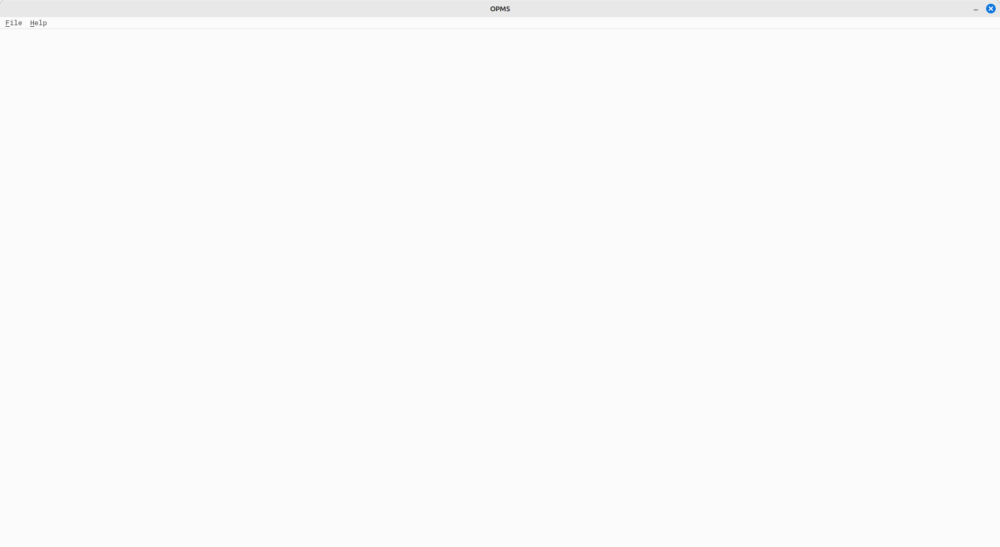
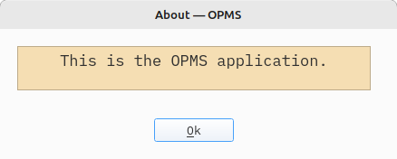
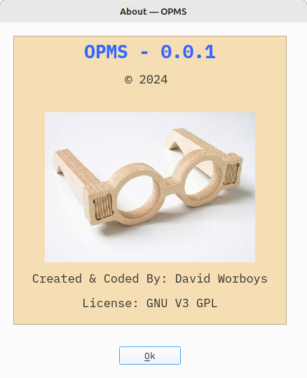

# OPMS 
### (Optometrist Patient Management System)
### A QTPYGUI Example Application
### Author: David Worboys 
##### 2023-10-01 - Initial Draft

## Introduction
In the authors view, the best way to learn how to use a new library is to use it.
In this vein, I will be writing an example application that utilises QTPYGUI. The
example application is OPMS - the Optometrist Patient Management System - and I 
will endeavour to use as many QTPYGUI features as possible. 

## Getting Started
Starting to develop a new QTPYGUI application is a five step process.
1. Setup a Python virtual environment - this is the best way to develop Python
applications.
   - Note: QTPYGUI requires a Pyton version >= 3.8
2. Activate the virtual environment.
3. At the command prompt type:
   - ```pip install QTPYGUI```
4. Create the main application file and the system constants file.
   - In this example, opms.py and sys_consts.py
5. Enter the following in sys_consts.py
 
```
import datetime
from typing import Final

PROGRAM_NAME: Final[str] = "OPMS"
PROGRAM_VERSION: Final[str] = "0.0.1"
AUTHOR: Final[str] = "Jeff Who?"
LICENCE: Final[str] = "GNU V3 GPL"

def COPYRIGHT_YEAR() -> str: 
    return f"{'2024' if str(datetime.date.today().year) == '2024' else '2024-' + str(datetime.date.today().year)}"


VERSION_TAG = (
    f"{PROGRAM_NAME} {PROGRAM_VERSION} {LICENCE} (c){COPYRIGHT_YEAR()} {AUTHOR} "
)
```
 
## Setup opms.py
opms.py is the root (main) file of the OPMS application. It is where the application
is set up, configured and ran

The structure of opms.py is built on that in [example_01](https://github.com/David-Worboys/QTPYGUI/blob/master/examples/example_01.py)

```
import QTPYGUI.qtpygui as qtg
import QTPYGUI.popups as popups
import sys_consts


class OPMS:
    def __init__(self):
        self.opms = qtg.QtPyApp(
            display_name="OPMS",
            callback=self.event_handler,
            height=100,
            width=100,
        )

    def event_handler(self, event: qtg.Action):
        """Handles  form events
        Args:
            event (qtg.Action): The triggering event
        """
        print(
            f"DBG {event.event=} {event.action=} {event.container_tag=} {event.tag} {event.value}"
        )
        assert isinstance(event, qtg.Action), f"{event=}. Must be Action"

        match event.event:
            case qtg.Sys_Events.CLICKED:
                pass
            case qtg.Sys_Events.MENUCLICKED:                    
                match event.tag:
                    case "app_exit":
                        self.opms.app_exit()

    def layout(self) -> qtg.VBoxContainer:
        """The layout of the OPMS main window
        Returns:
            qtg.VBoxContainer: The OPMS main window layout
        """

        def main_menu() -> qtg.Menu:
            """Creates the OPMS main menu

            Returns:
                qtg.Menu: The main menu
            """
            menu = qtg.Menu(container_tag="main_menu", tag="main_menu")

            # Top level menu elements
            menu.element_add(
                parent_tag="",
                menu_element=qtg.Menu_Element(
                    text="&File", tag="file", callback=self.event_handler
                ),
            )

            menu.element_add(
                parent_tag="",
                menu_element=qtg.Menu_Element(
                    text="&Help", tag="help", callback=self.event_handler
                ),
            )

            # File menu elements - note tag file
            menu.element_add(
                parent_tag="file",
                menu_element=qtg.Menu_Element(
                    separator=True,
                ),
            )

            menu.element_add(
                parent_tag="file",
                menu_element=qtg.Menu_Element(
                    text="&Exit", tag="app_exit", callback=self.event_handler
                ),
            )

            # Help menu elements - note tag help
            menu.element_add(
                parent_tag="help",
                menu_element=qtg.Menu_Element(
                    text="&About",
                    tag="about",
                    callback=self.event_handler,
                ),
            )

            return menu

        return qtg.VBoxContainer(
            align=qtg.Align.BOTTOMRIGHT,
            pixel_unit=True,
            width=self.opms.available_width - 50,
            height=self.opms.available_height - 50,
        ).add_row(
            main_menu(),
        )

    def run(self):
        """Run OPMS (Optometrist Patient Management System)"""
        self.opms.run(layout=self.layout())


if __name__ == "__main__":
    opms = OPMS()
    opms.run()
```
When this file is executed, it will open a window - titled OPMS - and have a 
menu bar with  'File' and 'About' entries. Selecting 'File' allows the user
to exit the application by selecting the 'Exit' option.

**Note: In the 'event_handler' method, I have placed the following print statement
as it is a good way to see the events being generated.** 
```
print(f"DBG {event.event=} {event.action=} {event.container_tag=} {event.tag} {event.value}")
```
**This needs to be removed before the application is released.**



The menu is generated in the 'layout' method by the inner function 'main_menu'.
Menues generally have lots of entries, so it is best to configure them in an
'layout' inner function. 

This is a good general rule, whenever a GUI element is likely to have a complex
setup place it in a 'layout' inner function.

## Adding The 'About Window'
Every serious application needs an 'About Window' and adding one to OPMS is 
straightforward as there is a special popup just for that - PopAbout. To make 
an 'About Window' appear, this is all the code needed in the OPMS class 
'event_handler'  method:

```
case qtg.Sys_Events.MENUCLICKED:
                match event.tag:
                    case "about":
                        informative_text ="This is the OPMS application."
                        popups.PopAbout(
                            title="About",
                            informative_text=informative_text,
                            informative_font=qtg.Font(size=13, backcolor="wheat"),
                            height=20,
                            border=qtg.Widget_Frame(
                                frame=qtg.Frame.RAISED, frame_style=qtg.Frame_Style.PANEL, line_width=1
                            ),
                        ).show()
```
Run OPMS and select 'Help' from the menu bar and the 'About' option, and this 
window opens:



Which does not look very exciting, but wait there is more! The argument 'informative_text'
can take HTML marked-up text.

Change 'informative_text', like so

```
informative_text = (
                    '<h2 style="text-align: center;"><strong><span style="color:'
                    f' #3366ff;">{sys_consts.PROGRAM_NAME} - {sys_consts.PROGRAM_VERSION}'
                    f'</span></strong></h2><p style="text-align: center;">&#169;'
                    f' {sys_consts.COPYRIGHT_YEAR()} </p><p style="text-align: center;">'
                    f' <br/></p>'
                    f'<p style="text-align: center;">Created & Coded By: '
                    f'{sys_consts.AUTHOR}</p><p style="text-align:'
                    f' center;">License: {sys_consts.LICENCE}</p>'
)
```
and run OPMS again, select 'Help' from the menu bar and the 'About' option and 
this windows opens:



Which looks so much better!

## OPMS Startup Configuration
Applications need to do a number of housekeeping tasks at startup, e.g., amongst
other tasks, they need to establish database connections, ensure configuration 
directories and files are created and correct, log a user on and load a user's 
configuration.

In the OPMS class 'event_handler' method the APPPOSTINIT event is caught, and the
startup activities are perfomed in a new method - 'startup_handler'. 
```
match event.event:
     case qtg.Sys_Events.APPPOSTINIT:
         self.startup_handler()
```

It is good practice to separate data from the user interface and, as OPMS will 
use a database, a database.py file needs to be created to handle database 
configuration and query operations.


# TO BE CONTINUED....